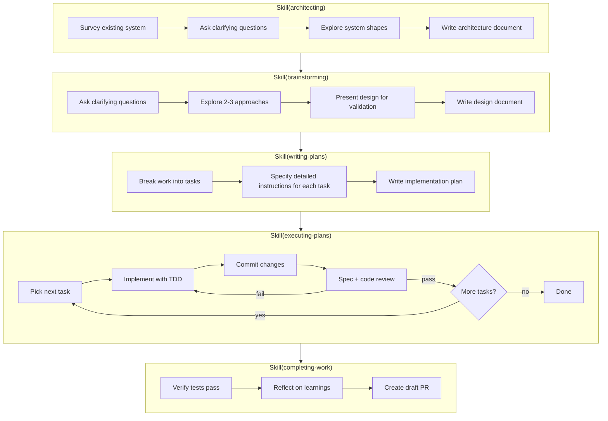

# Documentation Restructure Implementation Plan

> **For Claude:** REQUIRED SUB-SKILL: Use Skill(executing-plans) to implement this plan task-by-task.

**Goal:** Restructure repository documentation into a slim README landing page with a `docs/` directory for all supporting content, eliminating duplication between README and CLAUDE.md.

**Architecture:** Move content from the monolithic README into focused docs/ files. DESIGN.md and FUTURE.md move into docs/ with renamed filenames. CLAUDE.md drops duplicated tables and references docs/ instead. A new claude-code-config.md explains the stow-managed configuration.

**Tech Stack:** Markdown, Git

---

### Task 1: Move DESIGN.md and FUTURE.md into docs/

**Files:**
- Create: `docs/design-decisions.md`
- Create: `docs/future.md`
- Delete: `DESIGN.md`
- Delete: `FUTURE.md`

**Step 1: Create docs/ directory and move files**

Create `docs/design-decisions.md` with the exact contents of `DESIGN.md` (no changes to content).

Create `docs/future.md` with the exact contents of `FUTURE.md` (no changes to content).

Delete `DESIGN.md` and `FUTURE.md` from the repo root.

**Step 2: Commit**

```bash
git add docs/design-decisions.md docs/future.md && git rm DESIGN.md FUTURE.md && git commit -m "docs: move DESIGN.md and FUTURE.md into docs/"
```

---

### Task 2: Create docs/workflow.md

**Files:**
- Create: `docs/workflow.md`

**Step 1: Write docs/workflow.md**

Extract the "Structured Development Workflow" section from `README.md` (lines 32-101). Write it as a standalone document:

```markdown
# Structured Development Workflow

A workflow for reliably turning ideas into pull requests, adapted from [superpowers](https://github.com/obra/superpowers).

## Overview



## How to Use

Ask Claude to architect or brainstorm your idea:

```
> You: Architect how we should restructure the notification system.
> Claude: Using Skill(architecting) ...

> You: Brainstorm how we can implement ticket ABC-123.
> Claude: Using Skill(brainstorming) ...
```

Answer Claude's questions as you proceed through the workflow.

## When to Use This Workflow

**Use the structured workflow** when:
- Building a significant feature that spans multiple files
- You want independent code reviews after each task
- The implementation would benefit from upfront design discussion
- You want a written plan you can review before execution

**Use Claude Code's built-in planning mode** when:
- Making smaller, well-defined changes
- The scope is clear and doesn't need exploration
- You want faster iteration with less ceremony
```

**Step 2: Commit**

```bash
git add docs/workflow.md && git commit -m "docs: extract workflow documentation into docs/"
```

---

### Task 3: Create docs/integrations.md

**Files:**
- Create: `docs/integrations.md`

**Step 1: Write docs/integrations.md**

Extract the "Integrations" section from `README.md` (lines 120-179) plus the "Claude Code Orchestrator" summary (lines 104-116). Write as a standalone document:

```markdown
# Integrations

## Claude Code Orchestrator

`cco` lets you run multiple Claude Code sessions in parallel, each on its own branch. It uses Git worktrees and tmux to keep sessions isolated from each other and from your main working tree.

```sh
cco add feature-branch       # create workspace, launch Claude Code
cco attach feature-branch    # switch to it later
cco rm feature-branch        # clean up when done (keeps the branch)
```

`cco` also supports advanced features for executing plans inside an isolated sandbox VM.

See the [cco README](../cco/README.md) for full documentation.

## Atlassian (Jira + Confluence)

Read and write access to Jira issues, Confluence pages, and Compass via the official Atlassian MCP server.

**Setup:**

1. Start Claude Code in any project
2. Run `/mcp` and select "Authenticate" for Atlassian
3. Complete OAuth flow in browser
4. Done - Jira and Confluence tools now available

**Capabilities:**
- **Jira:** Search, create, and update issues
- **Confluence:** Search, create, and update pages
- **Compass:** Query and create service components

**Requirements:**
- Atlassian Cloud account (Server/Data Center not supported)
- Internet connection for remote MCP server

## Browser Automation

Automate browser interactions for web testing, form filling, screenshots, and data extraction using [playwright-cli](https://github.com/microsoft/playwright-cli).

**Setup:** Installed automatically by `setup.sh` via `npm install -g @playwright/cli@latest`.

**Capabilities:**
- Navigate websites and interact with page elements
- Fill forms, click buttons, take screenshots
- Manage browser sessions, tabs, cookies, and storage
- Network request mocking and DevTools integration

**Usage:** Ask Claude to browse a website or interact with a web page, and it will use the `automating-browsers` skill automatically.

## Datadog Logs

Search Datadog logs directly from Claude using the `searching-datadog-logs` skill.

**Setup:**

Store your Datadog API credentials in macOS Keychain:

```bash
security add-generic-password -s searching-datadog-logs -a api-key -w <YOUR_DD_API_KEY>
security add-generic-password -s searching-datadog-logs -a app-key -w <YOUR_DD_APP_KEY>
```

**Capabilities:**
- Search logs by query, service, status, time range
- Fetch full log details by ID
- Error-driven investigation from stack traces
- Exploratory search with query refinement

## Steven (Personal Work Assistant)

A persistent work assistant accessible from any Claude Code session via `/asking-steven`. Steven maintains long-term memory across sessions using an Obsidian vault and [QMD](https://github.com/tobi/qmd) semantic search — saving decisions, surfacing context, and pulling data from Jira and Confluence on a schedule.

See the [Steven README](../steven/README.md) for setup, usage, and architecture details.
```

**Step 2: Commit**

```bash
git add docs/integrations.md && git commit -m "docs: extract integration guides into docs/"
```

---

### Task 4: Create docs/skills.md

**Files:**
- Create: `docs/skills.md`

**Step 1: Write docs/skills.md**

Extract the skill/agent tables from `CLAUDE.md` (lines 48-91). Write as a standalone document. This becomes the single source of truth — both README and CLAUDE.md will reference it.

```markdown
# Skills and Agents

## Workflow Skills

| Skill | Purpose |
|---|---|
| `architecting` | Describe the shape of a system: components, responsibilities, boundaries |
| `brainstorming` | Turn ideas into designs through collaborative dialogue |
| `writing-plans` | Create detailed implementation plans with TDD steps |
| `executing-plans` | Execute plans with subagent implementation + reviews |
| `executing-plans-quickly` | Execute plans inline without subagents for simple tasks |
| `executing-plans-in-sandbox` | Execute plans autonomously in a sandbox VM |
| `completing-work` | Verify tests, present options, create or update PR |
| `reviewing-prs` | Holistic PR review across 6 parallel dimensions |

## Integrations

| Integration | Purpose |
|---|---|
| Atlassian MCP | Read/write access to Jira, Confluence, and Compass |
| `automating-browsers` | Browser automation for testing and data extraction |
| `managing-launchd-agents` | Manage macOS launchd user agents |
| `searching-datadog-logs` | Search Datadog logs via the API |
| `creating-jira-tickets` | Draft and create well-structured Jira tickets |
| `asking-steven` | Persistent work assistant with long-term memory |

## Reference Skills

| Skill | Purpose |
|---|---|
| `test-driven-development` | TDD discipline: red-green-refactor cycle |

## Meta Skills

| Skill | Purpose |
|---|---|
| `creating-skills` | Guide for creating new skills |

## Agents

| Agent | Purpose |
|---|---|
| `code-reviewer` | Review code changes against plans and standards |
```

**Step 2: Commit**

```bash
git add docs/skills.md && git commit -m "docs: extract skills catalog into docs/"
```

---

### Task 5: Create docs/claude-code-config.md

**Files:**
- Create: `docs/claude-code-config.md`

**Step 1: Write docs/claude-code-config.md**

New document explaining the Claude Code configuration managed by this repo. Content drawn from CLAUDE.md's "Repository Structure" and "Modifying This Repository" sections, expanded into a proper standalone guide.

```markdown
# Claude Code Configuration

This repository manages Claude Code configuration files in the `claude/` directory. The `setup.sh` script uses [GNU Stow](https://www.gnu.org/software/stow/) to symlink `claude/` → `~/.claude/`, so changes made here are immediately reflected in your Claude Code environment.

## Directory Structure

```
claude/
├── CLAUDE.md           # Global instructions for all projects
├── settings.json       # Permissions and hooks
├── agents/             # Custom agent definitions
├── commands/           # Slash command definitions
├── hooks/              # PreToolUse hooks (e.g., gitleaks)
├── scripts/            # Status line and other scripts
└── skills/             # Custom skill definitions
```

## How It Works

Running `./setup.sh` creates symlinks from `claude/` into `~/.claude/`. For example:
- `claude/settings.json` → `~/.claude/settings.json`
- `claude/skills/brainstorming/SKILL.md` → `~/.claude/skills/brainstorming/SKILL.md`

This means every Claude Code session on your machine picks up these settings, skills, and agents automatically.

## Modifying Configuration

**Always edit files in the `claude/` directory**, never in `~/.claude/` directly. The files in `~/.claude/` are symlinks — editing them in place can break the stow linkage.

Examples:
- Edit `./claude/skills/foo.md`, NOT `~/.claude/skills/foo.md`
- Edit `./claude/settings.json`, NOT `~/.claude/settings.json`

After editing, run `./setup.sh` to apply changes.
```

**Step 2: Commit**

```bash
git add docs/claude-code-config.md && git commit -m "docs: add Claude Code configuration guide"
```

---

### Task 6: Rewrite README.md as slim landing page

**Files:**
- Modify: `README.md`

**Step 1: Rewrite README.md**

Replace the entire contents of `README.md` with a slim landing page:

```markdown
# claudefiles

My opinionated resources for working with [Claude Code](https://www.anthropic.com/claude-code).

## Features

- **[Structured Development Workflow](docs/workflow.md)** — Reliably turn ideas into pull requests
- **[Claude Code Orchestrator](cco/README.md)** — Develop in parallel using Git worktrees and tmux
- **[Integrations](docs/integrations.md)** — Connect to Jira, Confluence, Datadog, and browsers
- **[Steven](steven/README.md)** — Persistent work assistant with long-term memory

## Requirements

- [Claude Code](https://github.com/anthropics/claude-code)
- [Homebrew](https://brew.sh/) for macOS dependency management
- [Go](https://go.dev/) 1.23 for building `cco`
- [Node.js](https://nodejs.org/) 18+ for `automating-browsers` and `steven`
- macOS is assumed, but can be adapted for Linux

## Quick Start

```sh
git clone git@github.com:averycrespi/claudefiles.git
cd claudefiles
./setup.sh
```

The setup script will install dependencies, symlink configuration files to `~/.claude/`, and install `cco`.

## Documentation

| Doc | Purpose |
|-----|---------|
| [Workflow](docs/workflow.md) | How the structured development workflow works |
| [Skills Catalog](docs/skills.md) | All available skills and agents |
| [Integrations](docs/integrations.md) | Setup guides for external services |
| [Claude Code Config](docs/claude-code-config.md) | How the `~/.claude/` symlinks work |
| [Design Decisions](docs/design-decisions.md) | Why things are built this way |
| [Future](docs/future.md) | Planned improvements and explorations |

## Attribution

The workflow skills are adapted from [superpowers](https://github.com/obra/superpowers) by Jesse Vincent, licensed under MIT.

The `creating-skills` skill is adapted from [Anthropic's skill-creator](https://github.com/anthropics/skills/tree/main/skill-creator), licensed under Apache 2.0.

The `automating-browsers` skill is derived from [playwright-cli](https://github.com/microsoft/playwright-cli) by Microsoft, licensed under Apache 2.0.

The status line script is adapted from [claude-code-tools](https://github.com/pchalasani/claude-code-tools) by Prasad Chalasani, licensed under MIT.

## License

- Repository licensed under [MIT](./LICENSE)
- Individual skills and agents may have their own licenses
```

**Step 2: Commit**

```bash
git add README.md && git commit -m "docs: slim README to landing page with links to docs/"
```

---

### Task 7: Slim down project CLAUDE.md

**Files:**
- Modify: `CLAUDE.md`

**Step 1: Rewrite CLAUDE.md**

Replace the entire contents of `CLAUDE.md`, keeping only what Claude needs during a session and adding references to docs/ for everything else:

```markdown
# CLAUDE.md

Project-specific instructions for this repository.

## Public Repository Guidelines

This is a public repository. When creating or modifying content:

- **No internal details** - Don't reference specific companies, projects, team names, or internal URLs
- **No private data** - Don't include API keys, tokens, credentials, or sensitive configuration
- **Generic examples** - Use placeholders like `ABC-123` for tickets, `example.com` for domains
- **Sanitize plans** - Review `.plans/` files before committing to ensure they contain no proprietary information

## Setup

```bash
./setup.sh
```

See the [README](README.md) for requirements and quick start.

## Development Workflow

This repository includes a structured development workflow:

```
/architecting → /brainstorming → /writing-plans → /executing-plans → /completing-work
```

See [docs/workflow.md](docs/workflow.md) for details. See [docs/skills.md](docs/skills.md) for the full skills and agents catalog.

## Testing

Run cco tests:

```bash
cd cco && go test ./... -count=1
```

**Note:** tmux integration tests require sandbox to be disabled (`dangerouslyDisableSandbox`) due to Unix socket access at `/private/tmp/tmux-*/`. On macOS, use `filepath.EvalSymlinks` on temp dirs in Go tests to handle the `/var` → `/private/var` symlink.

## Modifying This Repository

- Edit files in `claude/` directory
- Run `./setup.sh` to apply changes via stow

**IMPORTANT:** Never edit files directly in `~/.claude/`. Those are symlinks managed by stow. Always edit the source files in this repository's `claude/` directory. For example:
- Edit `./claude/skills/foo.md`, NOT `~/.claude/skills/foo.md`
- Edit `./claude/settings.json`, NOT `~/.claude/settings.json`

See [docs/claude-code-config.md](docs/claude-code-config.md) for full details on the configuration structure.
```

**Step 2: Commit**

```bash
git add CLAUDE.md && git commit -m "docs: slim CLAUDE.md, reference docs/ for catalog and structure"
```
