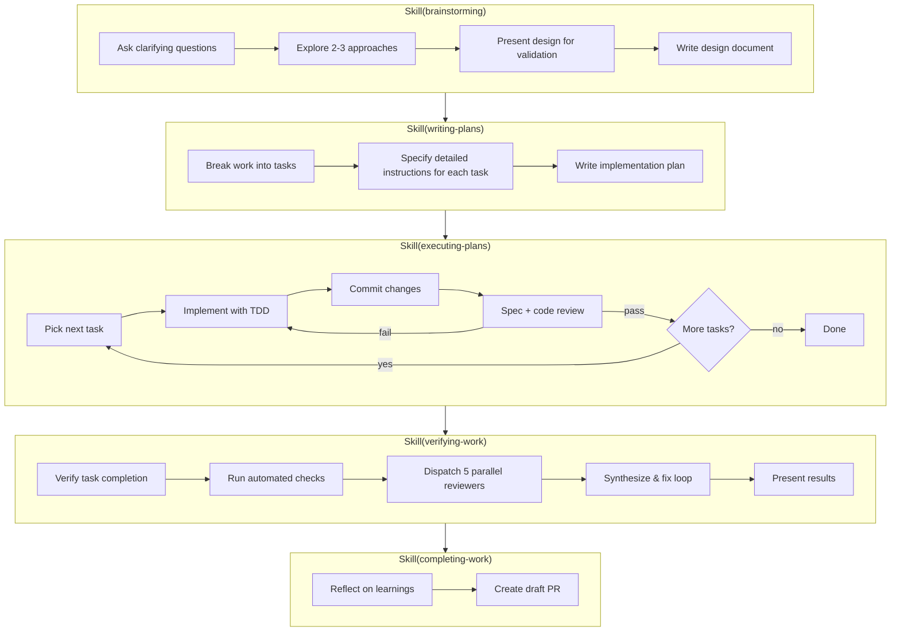

# Verifying Work Implementation Plan

> **For Claude:** REQUIRED SUB-SKILL: Use Skill(executing-plans) to implement this plan task-by-task.

**Goal:** Add a verifying-work skill to the structured development workflow that performs holistic review of all implemented work, auto-fixes clear issues, and surfaces ambiguous findings.

**Architecture:** New skill with SKILL.md orchestrator + 5 reviewer prompt files + 1 fixer prompt file. Updates to 3 executing-plans variants, completing-work, and 2 docs files to wire the new stage into the workflow.

**Tech Stack:** Markdown skill files, Claude Code skill system

---

### Task 1: Create verifying-work SKILL.md

**Files:**
- Create: `claude/skills/verifying-work/SKILL.md`

**Note:** This task has no tests — it creates a markdown skill definition.

**Step 1: Read the design document for reference**

Read: `.plans/2026-03-14-verifying-work-design.md`

Read the reviewing-prs SKILL.md as a structural reference since verifying-work follows a similar pattern (parallel reviewer dispatch + synthesis):

Read: `claude/skills/reviewing-prs/SKILL.md`

**Step 2: Create the SKILL.md file**

Create `claude/skills/verifying-work/SKILL.md` with this content:

```markdown
---
name: verifying-work
description: Use when finishing plan execution to holistically review all work before completing - runs automated checks, dispatches 5 parallel reviewers, auto-fixes clear issues, surfaces ambiguous findings
---

# Verifying Work

## Overview

Perform a holistic review of all work completed during plan execution. Run automated checks, dispatch 5 parallel reviewers for cross-cutting concerns, auto-fix clear issues, and surface ambiguous findings for user decision — before proceeding to PR creation.

**Core principle:** Per-task reviews catch task-level issues. This skill catches what only becomes visible when looking at all the work together: integration problems, inconsistencies, plan gaps, and cross-component concerns.

**Announce at start:** "I'm using the verifying-work skill to holistically review the implementation."

## The Process

### Phase 0: Verify Task Completion

Before any checks, verify all tasks from the plan are complete:

```
TaskList
```

**If any tasks remain `in_progress` or `pending`:**
```
Warning: [N] tasks not marked complete:
- Task 2: [subject] (in_progress)
- Task 5: [subject] (pending)

Continue anyway, or return to complete tasks?
```

Use `AskUserQuestion` to let user decide.

**If all tasks `completed`:** Proceed silently to Phase 1.

**If no tasks exist:** Proceed silently to Phase 1 (plan may have been executed without native task tracking).

### Phase 1: Automated Checks

Run hard gates before any AI review:

```bash
# Run project's test suite
npm test / cargo test / pytest / go test ./...

# Run linter if configured
npm run lint / cargo clippy / ruff check / golangci-lint run

# Run type-checker if configured
npx tsc --noEmit / mypy . / pyright
```

**If all pass:** Proceed to Phase 2.

**If any fail:** Dispatch a fixer agent with the failures:

```
Agent tool (general-purpose):
  description: "Fix automated check failures"
  prompt: [Use fixer-prompt.md template with CHECK_FAILURES filled in]
```

Re-run the failing checks. Up to 3 rounds total. If still failing after 3 rounds, stop and escalate to user:

```
Automated checks still failing after 3 fix attempts:

[Show remaining failures]

Cannot proceed with verification until checks pass.
```

### Phase 2: Gather Context and Dispatch Reviewers

**Gather context:**

1. Determine the base branch:
   ```
   git rev-parse --abbrev-ref origin/HEAD
   ```
   Fall back to `main` if the command fails.

2. Get the full diff:
   ```
   git diff <base-branch>...HEAD
   ```

3. Parse the diff to identify changed files (lines starting with `+++ b/`)

4. Read the full contents of each changed/added file using the Read tool

5. Look for plan files in `.plans/` directory — find the design document and implementation plan from conversation context or by globbing `.plans/*.md`

6. Read the project's CLAUDE.md if it exists

7. Assemble everything into a context block

**Dispatch 5 reviewer subagents:**

Launch all 5 in a SINGLE message with 5 Agent tool calls. Use `Agent tool (general-purpose)` with `model: haiku` for each.

Read each prompt file from the skill directory at dispatch time. Each agent's prompt is the prompt file content with the full context package appended.

| # | Reviewer | Prompt File |
|---|----------|-------------|
| 1 | Plan Completeness | `plan-completeness-prompt.md` |
| 2 | Integration Correctness | `integration-correctness-prompt.md` |
| 3 | Consistency | `consistency-prompt.md` |
| 4 | Security | `security-prompt.md` |
| 5 | Test Coverage | `test-coverage-prompt.md` |

**If no design document or plan file exists:** Skip the Plan Completeness reviewer. Dispatch the other 4.

Each agent MUST return findings in this format:

```
FINDINGS:
- <file>:<line> | <severity> | <confidence> | <auto-fixable:yes/no> | <description>
NO_FINDINGS (if nothing to report)
```

Where `<severity>` is one of: `blocker`, `important`, `suggestion`
Where `<confidence>` is an integer from 0 to 100.
Where `<auto-fixable>` is `yes` or `no`.

### Phase 3: Synthesize Findings

After all reviewers return:

1. **Parse** each agent's response for `FINDINGS:` or `NO_FINDINGS`
2. **Filter** — drop any finding with confidence below 80
3. **Deduplicate** — if multiple reviewers flag the same file:line range (within 3 lines), merge them keeping the highest severity and noting all contributing reviewers
4. **Split** into two buckets:
   - **Auto-fixable**: findings marked `auto-fixable:yes`
   - **Ambiguous**: findings marked `auto-fixable:no`

**If no findings remain after filtering:** Report clean verification, proceed directly to `Skill(completing-work)`.

### Phase 4: Fix Loop

**If auto-fixable issues exist:**

1. Dispatch single fixer agent (general-purpose, default model) with all auto-fixable findings:
   ```
   Agent tool (general-purpose):
     description: "Fix verification findings"
     prompt: [Use fixer-prompt.md template with FINDINGS filled in]
   ```

2. Parse fixer report:
   - Issues marked as fixed → track for report
   - Issues marked as unresolvable → reclassify as ambiguous

3. Re-run only the reviewers that originally flagged auto-fixable issues (same prompt files, updated diff)

4. Repeat up to 3 total rounds

5. Any issues remaining after 3 rounds → reclassify as ambiguous

### Phase 5: Present Results

Show the user a structured report:

```
## Verification Report

**Verdict: <Ready / Needs Attention>**

### Auto-Fixed (<N> issues)
- [<Reviewer>] <description> (fixed in <commit-sha>)

### Needs Your Input (<N> findings)
- [<Reviewer>] <description>
  `<file>:<line>` — <severity>
```

**If no ambiguous findings:** Proceed directly to `Skill(completing-work)`.

**If ambiguous findings exist:** Use `AskUserQuestion`:

```javascript
AskUserQuestion(
  questions: [{
    question: "Verification found findings that need your input. How would you like to proceed?",
    header: "Verify",
    multiSelect: false,
    options: [
      { label: "Proceed (Recommended)", description: "Continue to completing-work — findings are informational" },
      { label: "Address findings", description: "Work through findings before continuing" }
    ]
  }]
)
```

- **Proceed:** Call `Skill(completing-work)`
- **Address findings:** Work with user to resolve, then user can re-run verifying-work or proceed manually

## When to Stop and Ask

**STOP immediately when:**
- Automated checks fail after 3 fix rounds
- A reviewer finds a blocker that's not auto-fixable
- Fixer agent introduces new test failures that persist

## Red Flags

**Never:**
- Skip automated checks
- Dispatch reviewers against code that doesn't compile/pass tests
- Auto-fix ambiguous findings without user input
- Proceed past blockers without user acknowledgment

**Always:**
- Verify task completion before automated checks
- Run automated checks before AI reviewers
- Present all ambiguous findings to user
- Proceed to completing-work after verification

## Integration

**Required skills:**
- **completing-work** — Called after verification passes

**Used by:**
- **executing-plans** — Calls this skill after all task triplets complete
- **executing-plans-quickly** — Calls this skill after all task triplets complete
- **executing-plans-in-sandbox** — Calls this skill after sandbox results are pulled

## Prompt Templates

- `./plan-completeness-prompt.md` — Verify design/plan items are all implemented
- `./integration-correctness-prompt.md` — Verify cross-task dependencies and data flow
- `./consistency-prompt.md` — Verify uniform patterns across changeset
- `./security-prompt.md` — Holistic security review across all changes
- `./test-coverage-prompt.md` — Verify integration/E2E test coverage
- `./fixer-prompt.md` — Fix auto-fixable findings and automated check failures
```

**Step 3: Verify the file was created correctly**

Read: `claude/skills/verifying-work/SKILL.md`

Verify the frontmatter has `name` and `description`, and the file follows the same structural patterns as other skills.

**Step 4: Commit**

```bash
git add claude/skills/verifying-work/SKILL.md
git commit -m "feat(verifying-work): add main skill definition"
```

---

### Task 2: Create Reviewer Prompt Files

**Files:**
- Create: `claude/skills/verifying-work/plan-completeness-prompt.md`
- Create: `claude/skills/verifying-work/integration-correctness-prompt.md`
- Create: `claude/skills/verifying-work/consistency-prompt.md`
- Create: `claude/skills/verifying-work/security-prompt.md`
- Create: `claude/skills/verifying-work/test-coverage-prompt.md`

**Note:** This task has no tests — it creates markdown prompt templates.

**Step 1: Read existing reviewer prompts for reference**

Read the reviewing-prs prompts to match their structural conventions:

Read: `claude/skills/reviewing-prs/security-reviewer-prompt.md`
Read: `claude/skills/reviewing-prs/bug-hunter-prompt.md`
Read: `claude/skills/reviewing-prs/test-quality-prompt.md`

**Step 2: Create plan-completeness-prompt.md**

Create `claude/skills/verifying-work/plan-completeness-prompt.md`:

```markdown
# Plan Completeness Reviewer

## Role

Holistic reviewer verifying that every item in the design and implementation plan has been fully implemented — nothing missing, nothing half-done, no scope creep.

## Scope Rules

- Review the FULL changeset against the design document and implementation plan
- Compare plan requirements to actual implementation, not to prior code state
- Flag both missing items AND unplanned additions (scope creep)
- Use the design document for intent and the plan for specific deliverables

## What to Look For

**Missing implementations:**
- Plan tasks that have no corresponding code changes
- Requirements mentioned in design but not addressed in any task
- Partial implementations (feature started but not completed)
- Acceptance criteria from the plan that aren't met

**Scope creep:**
- Features or capabilities not described in the design or plan
- Over-engineering beyond what was specified
- "Nice to have" additions that weren't planned

**Deviations:**
- Implementation approaches that differ significantly from the plan's specified approach
- File paths or component names that don't match the plan
- Architectural decisions that diverge from the design document

## Confidence Scoring

Score each finding 0-100:
- **90-100**: Can point to the specific plan item and confirm it's missing/extra/wrong
- **80-89**: Strong evidence of a gap but some ambiguity in plan interpretation
- **Below 80**: Do not report — not confident enough to surface

## Severity

- **blocker**: Entire plan task unimplemented, critical requirement missing
- **important**: Partial implementation, minor requirement missed, notable scope creep
- **suggestion**: Minor deviation from plan, trivial scope addition

## Auto-Fixable Guide

Mark `auto-fixable:yes` ONLY if:
- A clearly specified, small piece is missing and the fix is unambiguous
- Example: plan says "add error message X" and it's missing — the fix is clear

Mark `auto-fixable:no` when:
- Missing feature requires design decisions
- Scope creep that needs user judgment on whether to keep or remove
- Architectural deviation that may be intentional

## Output Format

Return findings in EXACTLY this format (for parsing):

```
FINDINGS:
- <file>:<line> | <severity> | <confidence> | <auto-fixable:yes/no> | <description>
```

If no findings meet the 80+ confidence threshold, return:

```
NO_FINDINGS
```

Do not include any other text before FINDINGS: or NO_FINDINGS.
```

**Step 3: Create integration-correctness-prompt.md**

Create `claude/skills/verifying-work/integration-correctness-prompt.md`:

```markdown
# Integration Correctness Reviewer

## Role

Holistic reviewer verifying that independently implemented tasks compose correctly — cross-task dependencies work, shared state is handled properly, and API contracts between components are consistent.

## Scope Rules

- Review the FULL changeset holistically, not individual tasks in isolation
- Focus on boundaries and interactions between components
- Use full file context to understand integration points
- Consider both compile-time and runtime integration

## What to Look For

**Cross-task dependency issues:**
- Component A calls Component B with wrong arguments or types
- Shared data structures modified by one task but consumed differently by another
- Import/export mismatches between modules created in different tasks
- Initialization order dependencies that aren't enforced

**API contract mismatches:**
- Function signatures that don't match their call sites across task boundaries
- Data format assumptions that differ between producer and consumer
- Error types thrown by one component but not handled by its callers
- Return value contracts (nullable, optional, error cases) not honored

**Shared state issues:**
- Multiple components modifying the same state without coordination
- Configuration values assumed by multiple components with different defaults
- Resource lifecycle issues (who creates, who cleans up)
- Race conditions between components accessing shared resources

**Data flow problems:**
- Data transformations that lose information needed downstream
- Encoding/decoding mismatches at boundaries
- Missing validation at integration points

## Confidence Scoring

Score each finding 0-100:
- **90-100**: Can trace the exact mismatch between two components
- **80-89**: Strong evidence of integration issue but haven't verified at runtime
- **Below 80**: Do not report — not confident enough to surface

## Severity

- **blocker**: Will cause runtime errors or data corruption at integration points
- **important**: Subtle integration issue that may cause bugs under certain conditions
- **suggestion**: Integration pattern that could be improved for robustness

## Auto-Fixable Guide

Mark `auto-fixable:yes` ONLY if:
- The fix is a clear type/signature alignment between two components
- Example: function expects `string` but caller passes `number` — fix the caller

Mark `auto-fixable:no` when:
- The integration design itself may be wrong
- Multiple valid ways to resolve the mismatch
- Shared state coordination needs architectural decision

## Output Format

Return findings in EXACTLY this format (for parsing):

```
FINDINGS:
- <file>:<line> | <severity> | <confidence> | <auto-fixable:yes/no> | <description>
```

If no findings meet the 80+ confidence threshold, return:

```
NO_FINDINGS
```

Do not include any other text before FINDINGS: or NO_FINDINGS.
```

**Step 4: Create consistency-prompt.md**

Create `claude/skills/verifying-work/consistency-prompt.md`:

```markdown
# Consistency Reviewer

## Role

Holistic reviewer verifying that patterns are uniform across the entire changeset — error handling, naming conventions, logging styles, and code organization follow the same approach throughout.

## Scope Rules

- Review the FULL changeset for internal consistency
- Also check consistency with existing codebase patterns (using full file context)
- Focus on patterns that appear in multiple places — a one-off is not an inconsistency
- Do not flag style issues that a linter or formatter would catch

## What to Look For

**Error handling inconsistency:**
- Different error handling strategies in similar contexts (some throw, some return errors, some log and continue)
- Inconsistent error message formats or error types
- Some error paths with logging, others without
- Mixed approaches to error propagation (callbacks vs promises vs exceptions)

**Naming inconsistency:**
- Similar concepts named differently across files (e.g., `userId` vs `user_id` vs `userID`)
- Inconsistent function naming patterns (e.g., `getUser` vs `fetchUser` vs `loadUser`)
- Mixed casing conventions within the new code

**Logging and observability:**
- Some operations logged, similar operations not
- Inconsistent log levels for similar events
- Mixed structured vs unstructured logging

**Code organization:**
- Inconsistent file/module structure across similar components
- Mixed patterns for imports, exports, or module organization
- Inconsistent use of abstractions (some components use helpers, similar ones don't)

**API and interface patterns:**
- Inconsistent parameter ordering across similar functions
- Mixed return value patterns (some return objects, some return tuples)
- Inconsistent validation approaches at similar boundaries

## Confidence Scoring

Score each finding 0-100:
- **90-100**: Clear pattern used in 2+ places with a different pattern in another
- **80-89**: Likely inconsistency but pattern may be intentionally different due to context
- **Below 80**: Do not report — not confident enough to surface

## Severity

- **blocker**: Inconsistency that will confuse maintainers or cause bugs
- **important**: Notable pattern divergence that should be standardized
- **suggestion**: Minor style inconsistency, cosmetic

## Auto-Fixable Guide

Mark `auto-fixable:yes` ONLY if:
- The majority pattern is clear and the fix is straightforward renaming/reformatting
- Example: 4 functions use `getX()`, 1 uses `fetchX()` — rename to `getX()`

Mark `auto-fixable:no` when:
- No clear majority pattern (split decision)
- The inconsistency may be intentional for the specific context
- Fixing requires choosing between two valid approaches

## Output Format

Return findings in EXACTLY this format (for parsing):

```
FINDINGS:
- <file>:<line> | <severity> | <confidence> | <auto-fixable:yes/no> | <description>
```

If no findings meet the 80+ confidence threshold, return:

```
NO_FINDINGS
```

Do not include any other text before FINDINGS: or NO_FINDINGS.
```

**Step 5: Create security-prompt.md**

Create `claude/skills/verifying-work/security-prompt.md`:

```markdown
# Security Reviewer

## Role

Holistic security reviewer examining the full changeset for vulnerabilities that span multiple components — auth flows, input validation chains, data handling across boundaries, and secrets management.

## Scope Rules

- Review the FULL changeset, focusing on security implications of how components interact
- Pay special attention to trust boundaries (user input → processing → storage → output)
- Consider the complete data flow, not just individual functions
- Use full file context to understand the security model

## What to Look For

**Authentication and authorization:**
- Auth checks missing on new endpoints or operations
- Inconsistent auth enforcement across similar paths
- Privilege escalation paths through component interactions
- Session/token handling that differs between components

**Input validation chains:**
- Input validated in one component but used unsanitized in another
- Validation gaps at trust boundaries (external input → internal processing)
- Type coercion or encoding changes that bypass earlier validation
- Missing validation on data that crosses component boundaries

**Data handling across boundaries:**
- Sensitive data logged, exposed in errors, or returned in API responses
- PII flowing through components without proper handling
- Data serialization/deserialization that could be exploited
- Missing encryption for sensitive data at rest or in transit

**Injection vulnerabilities:**
- SQL injection through string concatenation across components
- Command injection where one component constructs commands from another's output
- XSS where data from one component renders in another without escaping
- Template injection, SSRF, or path traversal across component boundaries

**Secrets management:**
- Hardcoded credentials, API keys, or tokens
- Secrets passed through insecure channels (logs, error messages, URLs)
- Missing environment variable usage for configuration secrets

## Confidence Scoring

Score each finding 0-100:
- **90-100**: Can trace the exact vulnerability path with concrete evidence
- **80-89**: Strong suspicion with partial evidence — likely exploitable
- **Below 80**: Do not report — not confident enough to surface

## Severity

- **blocker**: Exploitable vulnerability, data exposure, auth bypass
- **important**: Security weakness that increases attack surface
- **suggestion**: Security hardening opportunity, defense in depth

## Auto-Fixable Guide

Mark `auto-fixable:yes` ONLY if:
- The fix is adding standard sanitization/validation that's clearly missing
- Example: user input concatenated into SQL — switch to parameterized query

Mark `auto-fixable:no` when:
- The security model itself may need redesign
- Multiple valid mitigation approaches exist
- Fix requires understanding threat model or compliance requirements

## Output Format

Return findings in EXACTLY this format (for parsing):

```
FINDINGS:
- <file>:<line> | <severity> | <confidence> | <auto-fixable:yes/no> | <description>
```

If no findings meet the 80+ confidence threshold, return:

```
NO_FINDINGS
```

Do not include any other text before FINDINGS: or NO_FINDINGS.
```

**Step 6: Create test-coverage-prompt.md**

Create `claude/skills/verifying-work/test-coverage-prompt.md`:

```markdown
# Test Coverage Reviewer

## Role

Holistic reviewer verifying that integration and end-to-end test coverage is adequate — per-task unit tests may all pass but miss cross-component scenarios and boundary edge cases.

## Scope Rules

- Review the FULL changeset for test coverage gaps at the integration level
- Do not re-review individual unit tests (per-task reviews already handled that)
- Focus on scenarios that span multiple components or tasks
- Consider both happy paths and error paths across component boundaries

## What to Look For

**Missing integration tests:**
- Components that interact but have no test verifying the interaction
- Data flowing through multiple components with no end-to-end test
- Error propagation paths across component boundaries untested
- Configuration combinations that affect multiple components

**Missing boundary tests:**
- Edge cases at integration points (empty inputs, max values, concurrent access)
- Error scenarios where one component fails and another must handle it
- Timeout and retry behavior across component boundaries
- Resource exhaustion scenarios (connection pools, memory, file handles)

**Test quality at integration level:**
- Integration tests that only verify happy path, not failure modes
- Tests that mock away the very integration they should be testing
- Missing cleanup/teardown that could cause test pollution
- Tests that depend on specific execution order

**Coverage gaps for new features:**
- New user-facing flows with no end-to-end test
- New API endpoints with no integration test covering auth + validation + business logic
- New background processes with no test verifying the complete lifecycle

## Confidence Scoring

Score each finding 0-100:
- **90-100**: Can identify the specific untested interaction with concrete evidence
- **80-89**: Strong evidence of coverage gap but some existing tests may partially cover it
- **Below 80**: Do not report — not confident enough to surface

## Severity

- **blocker**: Critical user flow or security boundary completely untested
- **important**: Notable integration scenario missing tests
- **suggestion**: Additional edge case test would improve confidence

## Auto-Fixable Guide

Mark `auto-fixable:yes` ONLY if:
- The missing test is obvious from existing test patterns
- Example: all other endpoints have auth tests, this new one doesn't

Mark `auto-fixable:no` when:
- The test requires understanding intended behavior at integration level
- Test setup is complex and needs design decisions
- Multiple valid testing approaches exist

## Output Format

Return findings in EXACTLY this format (for parsing):

```
FINDINGS:
- <file>:<line> | <severity> | <confidence> | <auto-fixable:yes/no> | <description>
```

If no findings meet the 80+ confidence threshold, return:

```
NO_FINDINGS
```

Do not include any other text before FINDINGS: or NO_FINDINGS.
```

**Step 7: Verify all prompt files exist**

Run: `ls claude/skills/verifying-work/`
Expected: SKILL.md, plan-completeness-prompt.md, integration-correctness-prompt.md, consistency-prompt.md, security-prompt.md, test-coverage-prompt.md

**Step 8: Commit**

```bash
git add claude/skills/verifying-work/plan-completeness-prompt.md claude/skills/verifying-work/integration-correctness-prompt.md claude/skills/verifying-work/consistency-prompt.md claude/skills/verifying-work/security-prompt.md claude/skills/verifying-work/test-coverage-prompt.md
git commit -m "feat(verifying-work): add reviewer prompt files"
```

---

### Task 3: Create Fixer Prompt File

**Files:**
- Create: `claude/skills/verifying-work/fixer-prompt.md`

**Note:** This task has no tests — it creates a markdown prompt template.

**Step 1: Create fixer-prompt.md**

Create `claude/skills/verifying-work/fixer-prompt.md`:

```markdown
# Fixer Agent Prompt Template

Use this template when dispatching the fixer agent. Fill in the appropriate section depending on whether fixing automated check failures or reviewer findings.

## For Automated Check Failures

```
Agent tool (general-purpose):
  description: "Fix automated check failures"
  prompt: |
    You are fixing automated check failures found during verification.

    ## Failures

    CHECK_FAILURES

    ## Instructions

    1. Read the failing output carefully
    2. Identify the root cause of each failure
    3. Fix the issues in the source code
    4. Run the checks again to verify fixes:
       - Tests: [test command from project]
       - Linter: [lint command if applicable]
       - Type-checker: [type-check command if applicable]
    5. If a fix is not obvious or requires a design decision, do NOT guess.
       Report it as unresolvable.

    ## Report Format

    FIXED:
    - <file>:<line> | <description of fix>

    UNRESOLVABLE:
    - <description> | <reason it cannot be auto-fixed>

    ## Commit

    After all fixes, commit with:
    git commit -m "fix: address verification check failures"
```

## For Reviewer Findings

```
Agent tool (general-purpose):
  description: "Fix verification findings"
  prompt: |
    You are fixing issues identified by verification reviewers.

    ## Findings to Fix

    FINDINGS

    ## Instructions

    1. Fix each finding listed above
    2. For each fix:
       - Read the relevant code
       - Make the minimal change needed
       - Ensure the fix doesn't break other functionality
    3. After all fixes, run the test suite to verify nothing broke:
       [test command from project]
    4. If a finding turns out to be ambiguous or requires a design decision,
       do NOT guess. Report it as unresolvable.
    5. If fixing one finding conflicts with another, report both as
       unresolvable and explain the conflict.

    ## Report Format

    FIXED:
    - <file>:<line> | <description of fix>

    UNRESOLVABLE:
    - <original finding> | <reason it cannot be auto-fixed>

    ## Commit

    After all fixes, commit with:
    git commit -m "fix: address verification findings"
```
```

**Step 2: Verify the file was created**

Read: `claude/skills/verifying-work/fixer-prompt.md`

**Step 3: Commit**

```bash
git add claude/skills/verifying-work/fixer-prompt.md
git commit -m "feat(verifying-work): add fixer agent prompt"
```

---

### Task 4: Update Executing Plans Variants

**Files:**
- Modify: `claude/skills/executing-plans/SKILL.md:262-269` (Step 3) and `:315-319` (Integration section)
- Modify: `claude/skills/executing-plans-quickly/SKILL.md:222-229` (Step 3) and `:253-261` (Integration section)
- Modify: `claude/skills/executing-plans-in-sandbox/SKILL.md:30-33` (Step 3)

**Note:** This task has no tests — it modifies markdown skill definitions.

**Step 1: Update executing-plans SKILL.md**

In `claude/skills/executing-plans/SKILL.md`, replace the process overview block (the pseudocode at lines 18-37) — change `Use completing-work` to `Use verifying-work`:

Replace:
```
After all triplets:
  Use completing-work
```
With:
```
After all triplets:
  Use verifying-work
```

Replace Step 3 (lines 262-269):
```
### Step 3: Complete Development

After all tasks complete:

1. Run full test suite to verify everything works together
2. **REQUIRED SUB-SKILL:** Use Skill(completing-work)
3. Follow that skill to verify tests, present options, execute choice
```
With:
```
### Step 3: Verify and Complete

After all tasks complete:

**REQUIRED SUB-SKILL:** Use Skill(verifying-work)
```

Replace the Integration section (lines 315-319):
```
**Required skills:**
- **following-tdd** - Implementation discipline
- **completing-work** - Complete development after all tasks
```
With:
```
**Required skills:**
- **following-tdd** - Implementation discipline
- **verifying-work** - Holistic review after all tasks complete
```

**Step 2: Update executing-plans-quickly SKILL.md**

In `claude/skills/executing-plans-quickly/SKILL.md`, replace the process overview block (lines 30-47) — change `Use completing-work` to `Use verifying-work`:

Replace:
```
After all triplets:
  Use completing-work
```
With:
```
After all triplets:
  Use verifying-work
```

Replace Step 3 (lines 222-229):
```
### Step 3: Complete Development

After all tasks complete:

1. Run full test suite to verify everything works together
2. **REQUIRED SUB-SKILL:** Use Skill(completing-work)
3. Follow that skill to verify tests, present options, execute choice
```
With:
```
### Step 3: Verify and Complete

After all tasks complete:

**REQUIRED SUB-SKILL:** Use Skill(verifying-work)
```

Replace the Integration section (lines 253-261):
```
**Required skills:**
- **following-tdd** - Implementation discipline
- **completing-work** - Complete development after all tasks
```
With:
```
**Required skills:**
- **following-tdd** - Implementation discipline
- **verifying-work** - Holistic review after all tasks complete
```

**Step 3: Update executing-plans-in-sandbox SKILL.md**

In `claude/skills/executing-plans-in-sandbox/SKILL.md`, replace Step 3 (lines 30-33):

```
### Step 3: Complete Development

**REQUIRED SUB-SKILL:** Use Skill(completing-work)
```
With:
```
### Step 3: Verify and Complete

**REQUIRED SUB-SKILL:** Use Skill(verifying-work)
```

**Step 4: Verify all three files have been updated**

Read each file and verify that:
- No references to `completing-work` remain in any of the three files
- `verifying-work` appears in the correct locations

**Step 5: Commit**

```bash
git add claude/skills/executing-plans/SKILL.md claude/skills/executing-plans-quickly/SKILL.md claude/skills/executing-plans-in-sandbox/SKILL.md
git commit -m "feat(verifying-work): update executing-plans variants to call verifying-work"
```

---

### Task 5: Update Completing Work

**Files:**
- Modify: `claude/skills/completing-work/SKILL.md`

**Note:** This task has no tests — it modifies a markdown skill definition.

**Step 1: Read the current completing-work SKILL.md**

Read: `claude/skills/completing-work/SKILL.md`

**Step 2: Update the description frontmatter**

Replace:
```
description: Use when finishing the structured development workflow after executing a plan - verifies task completion, reflects on learnings, and presents PR options
```
With:
```
description: Use when finishing the structured development workflow after verifying work - cleans up plan files, reflects on learnings, and presents PR options
```

**Step 3: Update the overview**

Replace:
```
**Core principle:** Verify task completion → Verify tests → Clean up plan files → Reflect on learnings → Present options → Execute choice.
```
With:
```
**Core principle:** Clean up plan files → Reflect on learnings → Present options → Execute choice.
```

**Step 4: Remove Step 0 (Verify Task Completion) and Step 1 (Verify Tests)**

Delete the entire Step 0 section (lines 18-39) and Step 1 section (lines 41-61).

**Step 5: Renumber remaining steps**

- Step 2 (Clean Up Plan Files) → Step 0
- Step 3 (Reflect on Learnings) → Step 1
- Step 4 (Detect Existing PR and Present Options) → Step 2
- Step 5 (Execute Choice) → Step 3

Update all internal references to step numbers accordingly. For example, "continue to Step 4" becomes "continue to Step 2", etc.

**Step 6: Update Common Mistakes section**

Remove the "Skipping test verification" entry since tests are no longer this skill's responsibility.

**Step 7: Update Red Flags section**

Replace:
```
**Never:**
- Proceed with failing tests
- Merge without verifying tests on result
- Delete work without confirmation
- Force-push without explicit request

**Always:**
- Verify task completion before verifying tests
- Verify tests before offering options
- Clean up plan files after tests pass
- Skip reflection silently if no learnings to propose
- Present exactly 2 options (create PR, update PR, or keep branch — depending on whether a PR exists)
```
With:
```
**Never:**
- Delete work without confirmation
- Force-push without explicit request

**Always:**
- Clean up plan files before reflecting
- Skip reflection silently if no learnings to propose
- Present exactly 2 options (create PR, update PR, or keep branch — depending on whether a PR exists)
```

**Step 8: Verify the updated file**

Read: `claude/skills/completing-work/SKILL.md`

Verify:
- No references to "Verify Task Completion" or "Verify Tests" remain
- Steps are numbered 0-3
- The file is internally consistent

**Step 9: Commit**

```bash
git add claude/skills/completing-work/SKILL.md
git commit -m "refactor(completing-work): remove task check and test verification"
```

---

### Task 6: Update Workflow Documentation

**Files:**
- Modify: `docs/workflow.md`
- Modify: `docs/skills.md`

**Note:** This task has no tests — it modifies documentation files.

**Step 1: Update workflow.md flowchart**

In `docs/workflow.md`, replace the mermaid flowchart (lines 7-36) with:



Note the changes:
- Added `Verifying` subgraph between Executing and Completing
- Updated Completing to remove "Verify tests pass" (was C1), now starts with "Reflect on learnings"
- Updated flow line to include `Verifying`

**Step 2: Update docs/skills.md**

In `docs/skills.md`, add a row for `verifying-work` in the Workflow Skills table. Insert it between `executing-plans-in-sandbox` and `completing-work` to maintain workflow order:

Replace:
```
| `executing-plans-in-sandbox` | Execute plans autonomously in a sandbox VM |
| `completing-work` | Verify tests, present options, create or update PR |
```
With:
```
| `executing-plans-in-sandbox` | Execute plans autonomously in a sandbox VM |
| `verifying-work` | Holistic review with parallel reviewers, auto-fix loop, and user escalation |
| `completing-work` | Clean up plans, reflect on learnings, create or update PR |
```

Note: also update the completing-work description to reflect that it no longer verifies tests.

**Step 3: Verify both files**

Read: `docs/workflow.md`
Read: `docs/skills.md`

Verify:
- workflow.md has 5 subgraphs: Brainstorming, Planning, Executing, Verifying, Completing
- workflow.md flow line includes all 5 stages
- skills.md has verifying-work row in correct position
- completing-work description is updated

**Step 4: Commit**

```bash
git add docs/workflow.md docs/skills.md
git commit -m "docs: add verifying-work to workflow and skills catalog"
```
