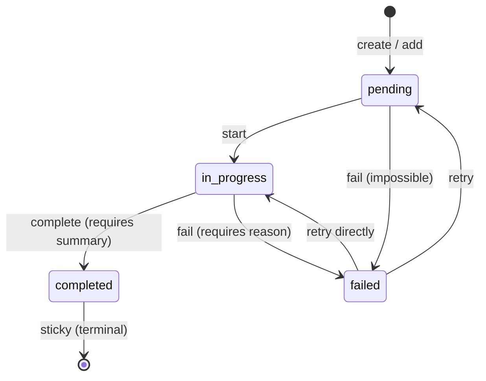
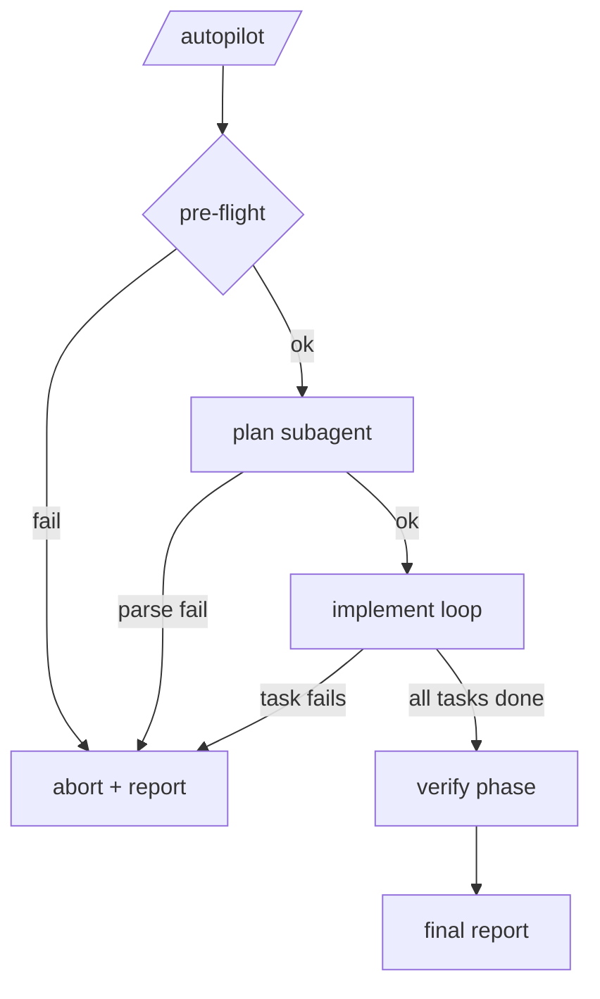

# Autopilot Implementation Plan

> **For Claude:** REQUIRED SUB-SKILL: Use Skill(executing-plans) to implement this plan task-by-task.

**Goal:** Build two Pi extensions (`task-list` and `autopilot`) plus an adapted Pi `brainstorming` skill, implementing an autonomous `/autopilot <design-file>` pipeline that dispatches subagents through plan → implement → verify and produces a PR-ready branch.

**Architecture:** Main session is a thin orchestrator (pure TypeScript, no LLM). All real work runs in subagents dispatched via the existing `subagents` extension. Task-list is an API-only session-scoped primitive with a rich inline TUI. All subagent outputs are strict JSON validated with TypeBox.

**Tech Stack:** TypeScript (Node 22+), `@mariozechner/pi-coding-agent` (extension API), `@mariozechner/pi-tui` (rendering), `@sinclair/typebox` (schemas), Node's built-in `node:test` via `--experimental-strip-types` for pure-logic tests, `make typecheck` as the hard gate.

**Design source:** `.designs/2026-04-12-autopilot.md` (commit this plan alongside it for cross-reference).

---

## Testing conventions for this plan

The repo does not currently use a test framework. This plan uses:

- **Pure-logic tests:** Node's built-in test runner against `.test.ts` files via `node --experimental-strip-types --test <file>`. No new dependencies.
- **Integration verification:** `make typecheck` as the automated gate, plus manual smoke-test instructions ("run `pi` in a scratch directory and type `/autopilot ...`") for anything that touches extension loading, subagent dispatch, or the TUI.

If Node's `--experimental-strip-types --test` combination does not work on the implementer's machine, fall back: add `"tsx": "^4.0.0"` to devDependencies and run `npx tsx --test <file>`. Do this inside Task 1 before committing scaffolding.

---

## Task 1: Repo scaffold and test-runner spike

**Files:**

- Create: `pi/agent/extensions/task-list/index.ts` (empty shell that exports a default factory)
- Create: `pi/agent/extensions/autopilot/index.ts` (empty shell that exports a default factory)
- Create: `pi/agent/extensions/task-list/.gitkeep` and `pi/agent/extensions/autopilot/prompts/.gitkeep` if empty directories need preservation
- Create: `pi/agent/extensions/task-list/smoke.test.ts` (one trivial test to prove the runner works)
- Modify: `tsconfig.json` if the new `.test.ts` files need inclusion or exclusion (check existing `include` / `exclude` patterns before editing)

**Step 1: Scaffold both extensions with minimal default factories**

```typescript
// pi/agent/extensions/task-list/index.ts
import type { ExtensionAPI } from "@mariozechner/pi-coding-agent";
export default function (_pi: ExtensionAPI) {
  // populated in later tasks
}
```

Same shape for `pi/agent/extensions/autopilot/index.ts`.

**Step 2: Write a trivial test to verify the runner**

```typescript
// pi/agent/extensions/task-list/smoke.test.ts
import { test } from "node:test";
import assert from "node:assert/strict";

test("test runner works", () => {
  assert.equal(1 + 1, 2);
});
```

**Step 3: Run the test**

Run: `node --experimental-strip-types --test pi/agent/extensions/task-list/smoke.test.ts`
Expected: PASS (one test passing). If it fails with a type-stripping error, install `tsx` and use `npx tsx --test ...` instead — then document the fallback at the top of the plan before continuing.

**Step 4: Verify typecheck passes**

Run: `make typecheck`
Expected: no errors.

**Step 5: Commit**

```bash
git add pi/agent/extensions/task-list/ pi/agent/extensions/autopilot/ tsconfig.json
git commit -m "chore(autopilot): scaffold extension directories"
```

---

## Task 2: Task state machine (pure logic)

**Files:**

- Create: `pi/agent/extensions/task-list/state.ts`
- Create: `pi/agent/extensions/task-list/state.test.ts`

**Step 1: Write the failing test file covering the state machine**

Write tests for every transition in the design doc's state-transition table, plus the `summary` / `failureReason` field rules, and the terminal-list auto-clear in `create`. Cover:

- Valid transitions succeed: `pending → in_progress`, `pending → failed`, `in_progress → completed` (with summary), `in_progress → failed` (with reason), `failed → pending`, `failed → in_progress`.
- Invalid transitions throw: `completed → *` (any target), `pending → completed`, `in_progress → pending`.
- `complete` without `summary` throws; `fail` without `reason` throws.
- `title` / `description` updates throw.
- `activity` settable while `in_progress`, cleared on transition out.
- `create` on empty list succeeds.
- `create` on all-terminal list auto-clears and succeeds.
- `create` on list with any `pending` or `in_progress` throws.

```typescript
// pi/agent/extensions/task-list/state.test.ts
import { test } from "node:test";
import assert from "node:assert/strict";
import { createStore, type Task } from "./state.ts";

test("create initializes pending tasks with sequential ids", () => {
  const store = createStore();
  const tasks = store.create([
    { title: "a", description: "aa" },
    { title: "b", description: "bb" },
  ]);
  assert.equal(tasks.length, 2);
  assert.deepEqual(
    tasks.map((t) => t.id),
    [1, 2],
  );
  assert.ok(tasks.every((t) => t.status === "pending"));
});

test("start transitions pending to in_progress", () => {
  const store = createStore();
  store.create([{ title: "a", description: "aa" }]);
  store.start(1);
  assert.equal(store.get(1)?.status, "in_progress");
});

test("completed is sticky — any further status change throws", () => {
  const store = createStore();
  store.create([{ title: "a", description: "aa" }]);
  store.start(1);
  store.complete(1, "did it");
  assert.throws(() => store.start(1));
  assert.throws(() => store.fail(1, "why"));
});

// ... add the remaining transitions and field rules
```

**Step 2: Run the tests to verify they fail**

Run: `node --experimental-strip-types --test pi/agent/extensions/task-list/state.test.ts`
Expected: FAIL (module not found / functions not defined).

**Step 3: Implement `state.ts` with the minimal API to pass the tests**

Export:

- `Task` and `TaskStatus` types matching the design doc.
- `TaskListState` interface.
- `createStore()` → returns an object with: `create`, `add`, `start`, `complete`, `fail`, `setActivity`, `get`, `all`, `clear`, `subscribe`. Each mutator enforces the state machine rules. `subscribe(fn)` returns an unsubscribe function. State is private to the store closure.

The state machine table lives in one place — e.g. a `const VALID_TRANSITIONS: Record<TaskStatus, TaskStatus[]>` — so adding new transitions later is a one-line change.

**Step 4: Run the tests to verify they pass**

Run: `node --experimental-strip-types --test pi/agent/extensions/task-list/state.test.ts`
Expected: PASS, all tests.

**Step 5: Typecheck**

Run: `make typecheck`
Expected: no errors.

**Step 6: Commit**

```bash
git add pi/agent/extensions/task-list/state.ts pi/agent/extensions/task-list/state.test.ts
git commit -m "feat(task-list): add task state machine with transition rules"
```

---

## Task 3: Task-list programmatic API singleton

**Files:**

- Modify: `pi/agent/extensions/task-list/index.ts`
- Create: `pi/agent/extensions/task-list/api.ts`
- Create: `pi/agent/extensions/task-list/api.test.ts`

**Step 1: Write tests for the singleton API**

The singleton wraps `createStore` so other extensions can import `taskList` directly and get a shared instance:

```typescript
// pi/agent/extensions/task-list/api.test.ts
import { test } from "node:test";
import assert from "node:assert/strict";
import { taskList } from "./api.ts";

test("taskList is a module-level singleton", async () => {
  taskList.clear();
  taskList.create([{ title: "a", description: "aa" }]);
  const reImport = (await import("./api.ts")).taskList;
  assert.equal(reImport.all().length, 1);
  taskList.clear();
});

test("subscribe fires on mutations and unsubscribe stops callbacks", () => {
  taskList.clear();
  let calls = 0;
  const unsubscribe = taskList.subscribe(() => {
    calls++;
  });
  taskList.create([{ title: "a", description: "aa" }]);
  assert.ok(calls >= 1);
  const before = calls;
  unsubscribe();
  taskList.start(1);
  assert.equal(calls, before);
  taskList.clear();
});
```

**Step 2: Run tests to verify they fail**

Expected: FAIL.

**Step 3: Implement `api.ts`**

```typescript
// pi/agent/extensions/task-list/api.ts
import { createStore } from "./state.ts";
export const taskList = createStore();
```

The store from Task 2 is self-contained; this file's only job is the singleton.

**Step 4: Run the tests to verify they pass**

Expected: PASS.

**Step 5: Typecheck**

Run: `make typecheck`

**Step 6: Commit**

```bash
git add pi/agent/extensions/task-list/api.ts pi/agent/extensions/task-list/api.test.ts
git commit -m "feat(task-list): expose singleton API"
```

---

## Task 4: Task-list TUI rendering

**Files:**

- Create: `pi/agent/extensions/task-list/render.ts`
- Create: `pi/agent/extensions/task-list/render.test.ts`
- Modify: `pi/agent/extensions/task-list/index.ts`

**Step 1: Write tests for the pure rendering helpers**

The renderer has pure bits (row-budget truncation, 30s grace window, status-to-glyph, summary line) and an impure bit (registering with `pi.registerMessageRenderer` and producing pi-tui `Component` trees). Tests cover only the pure bits.

```typescript
// pi/agent/extensions/task-list/render.test.ts
import { test } from "node:test";
import assert from "node:assert/strict";
import { glyphFor, truncateWithPriority, summarizeCounts } from "./render.ts";

test("glyphFor maps each status to the right symbol", () => {
  assert.equal(glyphFor("pending"), "◻");
  assert.equal(glyphFor("in_progress"), "◼");
  assert.equal(glyphFor("completed"), "✔");
  assert.equal(glyphFor("failed"), "✗");
});

test("summarizeCounts formats '<n> tasks (<done> done, <active> in progress, <open> open)'", () => {
  const counts = summarizeCounts([
    { status: "completed" },
    { status: "completed" },
    { status: "in_progress" },
    { status: "pending" },
    { status: "pending" },
  ] as any);
  assert.equal(counts, "5 tasks (2 done, 1 in progress, 2 open)");
});

test("truncateWithPriority keeps recently-completed (< 30s) above older completed", () => {
  const now = Date.now();
  const tasks = [
    { id: 1, status: "completed", completedAt: now - 60_000 }, // old
    { id: 2, status: "completed", completedAt: now - 1_000 }, // recent
    { id: 3, status: "in_progress" },
    { id: 4, status: "pending" },
  ] as any;
  const kept = truncateWithPriority(tasks, 3, now);
  // Priority: recently-completed → in_progress → pending → older-completed
  assert.deepEqual(
    kept.map((t: any) => t.id),
    [2, 3, 4],
  );
});
```

**Step 2: Run tests to verify they fail**

Expected: FAIL.

**Step 3: Implement `render.ts`**

Export pure helpers:

- `glyphFor(status)` → glyph string
- `styleFor(status)` → object `{ color: "success" | "accent" | "muted" | "error", bold: boolean, dim: boolean, strikethrough: boolean }`
- `summarizeCounts(tasks)` → header string
- `truncateWithPriority(tasks, budget, now)` → filtered subset in priority order, `budget = min(10, max(3, rows - 14))` is computed by the caller
- `renderTaskListMessage(state, options)` → returns a pi-tui `Component` tree. This is the function plugged into `pi.registerMessageRenderer`. Uses `Text` / vertical-stack components from `@mariozechner/pi-tui`. The existing `_shared/render.ts` has primitives to consult.

**Step 4: Wire into `index.ts`**

The extension factory now:

1. Calls `pi.registerMessageRenderer("task-list", renderTaskListMessage)`.
2. Subscribes to `taskList.subscribe` and on each change:
   - Debounce (100 ms) — use `setTimeout` with a nullable timer.
   - `pi.sendMessage({ customType: "task-list", content: [], display: true, details: currentState })`.
   - `ctx.ui.setStatus("task-list", minimalSummary)` as a complementary footer line (wrap in `if (ctx.hasUI)`). This `ctx` has to come from an event — for v1, hook `session_start` to capture `ctx` or pull from `pi.sendMessage`. If the `pi` API doesn't expose `ctx` from within a subscribe callback, drop the footer-status call for v1 and note in the README that only inline rendering is provided.
3. On `session_end`, auto-hide: `taskList.clear()` if anything remains.

**Step 5: Typecheck**

Run: `make typecheck`

**Step 6: Smoke test the TUI**

- In a scratch directory run: `pi`
- Load a short script into pi's REPL or via a quick scratch command that calls `taskList.create([...])` and a couple of state transitions.
- Verify the inline rendering appears with the right glyphs, colors, and updates on each mutation.
- Record the observed output in the commit message body.

**Step 7: Commit**

```bash
git add pi/agent/extensions/task-list/render.ts pi/agent/extensions/task-list/render.test.ts pi/agent/extensions/task-list/index.ts
git commit -m "feat(task-list): render task list as inline messages"
```

---

## Task 5: task-list README with mermaid state diagram

**Files:**

- Create: `pi/agent/extensions/task-list/README.md`

**Step 1: Draft the README following the conventions in `pi/agent/extensions/subagents/README.md`**

Required sections (see `.designs/2026-04-12-autopilot.md` §Documentation → `task-list/README.md`):

- One-line summary heading
- Programmatic API (full signature for each exported function)
- State model prose + mermaid diagram (copy from the design doc)
- TUI rendering section with ASCII example
- Consumers (autopilot is first; API is public)
- How it works
- Inspiration (Claude Code `TaskListV2`, `TodoWrite` auto-clear, ralph-wiggum checklist)
- File layout

The mermaid state diagram is:



Caption must highlight the "completion is sticky" anti-perfectionism nudge.

**Step 2: Render check**

Paste the mermaid source into <https://mermaid.live> (or GitHub's preview) to verify it renders. No command to run — visual check only.

**Step 3: Typecheck**

Run: `make typecheck` (safety — README changes shouldn't affect it but catches accidents).

**Step 4: Commit**

```bash
git add pi/agent/extensions/task-list/README.md
git commit -m "docs(task-list): add README with state machine diagram"
```

---

## Task 6: Autopilot shared helpers — parseJsonReport with TypeBox

**Files:**

- Create: `pi/agent/extensions/autopilot/lib/parse.ts`
- Create: `pi/agent/extensions/autopilot/lib/parse.test.ts`

**Step 1: Write tests for `parseJsonReport`**

````typescript
// pi/agent/extensions/autopilot/lib/parse.test.ts
import { test } from "node:test";
import assert from "node:assert/strict";
import { Type } from "@sinclair/typebox";
import { parseJsonReport } from "./parse.ts";

const Schema = Type.Object({
  outcome: Type.String(),
  commit: Type.Union([Type.String(), Type.Null()]),
});

test("parses clean JSON", () => {
  const r = parseJsonReport('{"outcome":"success","commit":"abc"}', Schema);
  assert.equal(r.ok, true);
  if (r.ok) assert.equal(r.data.outcome, "success");
});

test("strips ```json ... ``` fences", () => {
  const r = parseJsonReport(
    '```json\n{"outcome":"success","commit":null}\n```',
    Schema,
  );
  assert.equal(r.ok, true);
});

test("strips leading/trailing prose", () => {
  const r = parseJsonReport(
    'Here you go:\n{"outcome":"ok","commit":null}\nDone.',
    Schema,
  );
  assert.equal(r.ok, true);
});

test("returns {ok: false, error} on schema mismatch", () => {
  const r = parseJsonReport('{"outcome":42}', Schema);
  assert.equal(r.ok, false);
  if (!r.ok) assert.match(r.error, /outcome/);
});

test("returns {ok: false, error} on invalid JSON", () => {
  const r = parseJsonReport("not json at all", Schema);
  assert.equal(r.ok, false);
});
````

**Step 2: Run tests to verify they fail**

Expected: FAIL.

**Step 3: Implement `parse.ts`**

````typescript
import { Value } from "@sinclair/typebox/value";
import type { TSchema, Static } from "@sinclair/typebox";

export type ParseResult<T> =
  | { ok: true; data: T }
  | { ok: false; error: string };

export function parseJsonReport<S extends TSchema>(
  raw: string,
  schema: S,
): ParseResult<Static<S>> {
  const stripped = stripWrappers(raw);
  let parsed: unknown;
  try {
    parsed = JSON.parse(stripped);
  } catch (e) {
    return { ok: false, error: `JSON parse error: ${(e as Error).message}` };
  }
  if (!Value.Check(schema, parsed)) {
    const errors = [...Value.Errors(schema, parsed)]
      .slice(0, 3)
      .map((e) => `${e.path}: ${e.message}`)
      .join("; ");
    return { ok: false, error: `Schema validation failed: ${errors}` };
  }
  return { ok: true, data: parsed as Static<S> };
}

function stripWrappers(raw: string): string {
  // strip ```json ... ``` or ``` ... ``` fences
  const fence = raw.match(/```(?:json)?\s*\n([\s\S]*?)\n\s*```/);
  if (fence) return fence[1].trim();
  // if there's a clear JSON object, extract it
  const match = raw.match(/\{[\s\S]*\}/);
  return (match ? match[0] : raw).trim();
}
````

**Step 4: Run tests to verify they pass**

Expected: PASS.

**Step 5: Typecheck**

Run: `make typecheck`

**Step 6: Commit**

```bash
git add pi/agent/extensions/autopilot/lib/
git commit -m "feat(autopilot): add parseJsonReport helper with schema validation"
```

---

## Task 7: Autopilot subagent dispatch wrapper

**Files:**

- Create: `pi/agent/extensions/autopilot/lib/dispatch.ts`

**Step 1: Review what's exposed by `pi/agent/extensions/subagents/`**

Read `pi/agent/extensions/subagents/spawn.ts`. Identify:

- The `spawnSubagent` function signature and its `SpawnInvocation` type.
- Whether the function is exported from `index.ts` or only accessible via relative import.
- What `toolAllowlist`, `systemPrompt`, `prompt`, and `model` fields look like.

If `spawnSubagent` is not already exported from `subagents/index.ts`, add a re-export there as part of this task so autopilot can import without reaching into sibling internals. Commit the re-export as a separate small commit inside this task.

**Step 2: Define the autopilot dispatch wrapper**

```typescript
// pi/agent/extensions/autopilot/lib/dispatch.ts
import { spawnSubagent } from "../../subagents/spawn.ts";

export interface DispatchOptions {
  prompt: string; // user prompt for the subagent
  systemPrompt?: string; // overrides agent type's system prompt
  tools: ReadonlyArray<
    "read" | "write" | "edit" | "bash" | "ls" | "find" | "grep"
  >;
  extensions?: string[]; // e.g. ["web-access"]
  model?: string; // "openai-codex/gpt-5.4" etc.
  thinking?: "low" | "medium" | "high";
  signal?: AbortSignal;
  cwd: string;
}

export interface DispatchResult {
  ok: boolean; // child exit code 0
  stdout: string; // final assistant message from the child
  error?: string; // formatted message on failure
}

export async function dispatch(opts: DispatchOptions): Promise<DispatchResult> {
  const outcome = await spawnSubagent({
    prompt: opts.prompt,
    systemPrompt: opts.systemPrompt,
    toolAllowlist: opts.tools as any,
    extensionAllowlist: opts.extensions ?? [],
    model: opts.model,
    thinking: opts.thinking,
    cwd: opts.cwd,
    signal: opts.signal,
  });
  if (!outcome.ok) {
    return {
      ok: false,
      stdout: outcome.stdout,
      error: outcome.errorMessage ?? `exit ${outcome.exitCode}`,
    };
  }
  return { ok: true, stdout: outcome.stdout };
}
```

The wrapper gives us a single seam to mock in tests (later tasks will inject `dispatch` via a fake in phase tests) and also defaults the extension allowlist to nothing (autopilot subagents don't load `task-list` or other non-requested extensions — matches the design).

**Step 3: Typecheck**

Run: `make typecheck`

**Step 4: No behavioral test yet**

This wrapper delegates entirely to an existing function. Behavioral coverage comes when phases integrate it. Skip tests in this task; phase tests mock this module.

**Step 5: Commit**

```bash
git add pi/agent/extensions/autopilot/lib/dispatch.ts pi/agent/extensions/subagents/
git commit -m "feat(autopilot): add subagent dispatch wrapper"
```

---

## Task 8: Autopilot `/autopilot` command registration and pre-flight checks

**Files:**

- Modify: `pi/agent/extensions/autopilot/index.ts`
- Create: `pi/agent/extensions/autopilot/preflight.ts`
- Create: `pi/agent/extensions/autopilot/preflight.test.ts`

**Step 1: Write tests for pre-flight checks**

```typescript
// pi/agent/extensions/autopilot/preflight.test.ts
import { test } from "node:test";
import assert from "node:assert/strict";
import { mkdtempSync, writeFileSync } from "node:fs";
import { tmpdir } from "node:os";
import { join } from "node:path";
import { preflight } from "./preflight.ts";

test("fails when design file does not exist", async () => {
  const r = await preflight({
    designPath: "/does/not/exist.md",
    cwd: process.cwd(),
  });
  assert.equal(r.ok, false);
  if (!r.ok) assert.match(r.reason, /design file/i);
});

test("fails when design file is not a regular file", async () => {
  const dir = mkdtempSync(join(tmpdir(), "autopilot-"));
  const r = await preflight({ designPath: dir, cwd: process.cwd() });
  assert.equal(r.ok, false);
});

test("fails when working tree is dirty", async () => {
  // set up a temp git repo with a dirty file, then call preflight with cwd pointing at it.
  // Implementation detail for the test: use `git init`, touch a file, and exec git via node:child_process.
  // ...
});
```

Tests that require an isolated git repo use `mkdtempSync` + `execSync('git init ...')`. Keep them small; this is coverage for the orchestrator's pre-flight logic only.

**Step 2: Run tests to verify they fail**

Expected: FAIL.

**Step 3: Implement `preflight.ts`**

Exports `preflight({ designPath, cwd }): Promise<{ ok: true; baseSha: string; designText: string } | { ok: false; reason: string }>`.

Checks in order:

1. `fs.stat(designPath)` exists and is a regular file. On fail → `{ ok: false, reason: "design file not found: <path>" }` or similar.
2. Read the design file; reject if empty.
3. `git status --porcelain` in `cwd` is empty. On non-empty → `{ ok: false, reason: "working tree is dirty; commit or stash changes before /autopilot" }`.
4. Capture `git rev-parse HEAD` as `baseSha`.

Use `pi.exec` where available, or `node:child_process` `execFile` otherwise. The design mandates this runs against `cwd` (the repo the user invoked in), not any absolute path.

**Step 4: Register the `/autopilot` command in `index.ts`**

```typescript
// pi/agent/extensions/autopilot/index.ts
import type { ExtensionAPI } from "@mariozechner/pi-coding-agent";
import { preflight } from "./preflight.ts";

export default function (pi: ExtensionAPI) {
  pi.registerCommand("autopilot", {
    description:
      "Run the autonomous plan → implement → verify pipeline on a design document.",
    handler: async (args, ctx) => {
      await ctx.waitForIdle?.();
      const designPath = args.trim();
      if (!designPath) {
        // use ctx.ui if available, else print
        return;
      }
      const pre = await preflight({ designPath, cwd: process.cwd() });
      if (!pre.ok) {
        // report and return
        return;
      }
      // phases wired up in later tasks
    },
  });
}
```

The handler is a stub that performs pre-flight and stops. The rest of the pipeline is filled in by later tasks.

**Step 5: Run the tests**

Expected: PASS (pre-flight coverage only — the handler is a stub).

**Step 6: Typecheck**

Run: `make typecheck`

**Step 7: Smoke test**

- In a scratch dir: `pi`, then `/autopilot` with no args → should report "missing design path".
- In the same dir with a dirty tree, try `/autopilot some-file.md` → should report dirty-tree refusal.
- With a clean tree but no such file → "design file not found".

**Step 8: Commit**

```bash
git add pi/agent/extensions/autopilot/
git commit -m "feat(autopilot): register /autopilot command with pre-flight checks"
```

---

## Task 9: Plan phase — schemas, prompt, and phase function

**Files:**

- Create: `pi/agent/extensions/autopilot/prompts/plan.md`
- Create: `pi/agent/extensions/autopilot/phases/plan.ts`
- Create: `pi/agent/extensions/autopilot/phases/plan.test.ts`
- Create: `pi/agent/extensions/autopilot/lib/schemas.ts`

**Step 1: Write the schemas**

`pi/agent/extensions/autopilot/lib/schemas.ts` exports TypeBox schemas for all five subagent outputs: `PlanReportSchema`, `ImplementReportSchema`, `ValidationReportSchema`, `ReviewerReportSchema`, `FixerReportSchema`. Task 9 fills in the Plan schema; later tasks add the others.

```typescript
import { Type, type Static } from "@sinclair/typebox";

export const PlanTaskSchema = Type.Object({
  title: Type.String({ minLength: 1 }),
  description: Type.String({ minLength: 1 }),
});

export const PlanReportSchema = Type.Object({
  architecture_notes: Type.String({ minLength: 1 }),
  tasks: Type.Array(PlanTaskSchema, { minItems: 1, maxItems: 15 }),
});

export type PlanReport = Static<typeof PlanReportSchema>;
```

**Step 2: Write the prompt template file**

Copy the prompt body from `.designs/2026-04-12-autopilot.md` §Plan Phase verbatim into `prompts/plan.md`, leaving `{DESIGN_PATH}` as a placeholder.

**Step 3: Write the failing test for the plan phase**

```typescript
// pi/agent/extensions/autopilot/phases/plan.test.ts
import { test } from "node:test";
import assert from "node:assert/strict";
import { runPlan } from "./plan.ts";

const okDispatch = async () => ({
  ok: true,
  stdout: JSON.stringify({
    architecture_notes: "short notes",
    tasks: [
      { title: "A", description: "a" },
      { title: "B", description: "b" },
    ],
  }),
});

const badJson = async () => ({ ok: true, stdout: "not json" });
const badSchema = async () => ({
  ok: true,
  stdout: JSON.stringify({ architecture_notes: 1 }),
});

test("runPlan returns the parsed report on success", async () => {
  const r = await runPlan({ designPath: "x.md", dispatch: okDispatch });
  assert.equal(r.ok, true);
  if (r.ok) assert.equal(r.data.tasks.length, 2);
});

test("runPlan returns ok:false on JSON parse error", async () => {
  const r = await runPlan({ designPath: "x.md", dispatch: badJson });
  assert.equal(r.ok, false);
});

test("runPlan returns ok:false on schema validation error", async () => {
  const r = await runPlan({ designPath: "x.md", dispatch: badSchema });
  assert.equal(r.ok, false);
});
```

**Step 4: Run tests to verify they fail**

Expected: FAIL.

**Step 5: Implement `plan.ts`**

```typescript
import { readFile } from "node:fs/promises";
import { join } from "node:path";
import { parseJsonReport } from "../lib/parse.ts";
import { PlanReportSchema, type PlanReport } from "../lib/schemas.ts";
import type { DispatchOptions, DispatchResult } from "../lib/dispatch.ts";

const PROMPT_PATH = new URL("../prompts/plan.md", import.meta.url);

type Dispatch = (opts: DispatchOptions) => Promise<DispatchResult>;

export async function runPlan(args: {
  designPath: string;
  dispatch: Dispatch;
  cwd?: string;
}) {
  const template = await readFile(PROMPT_PATH, "utf8");
  const prompt = template.replace("{DESIGN_PATH}", args.designPath);
  const r = await args.dispatch({
    prompt,
    tools: ["read", "ls", "find", "grep"],
    cwd: args.cwd ?? process.cwd(),
  });
  if (!r.ok) return { ok: false as const, error: r.error ?? "dispatch failed" };
  return parseJsonReport(r.stdout, PlanReportSchema);
}
```

**Step 6: Run the tests to verify they pass**

Expected: PASS.

**Step 7: Wire runPlan into the `/autopilot` handler in `index.ts`**

After pre-flight, call `runPlan`. On success → `taskList.create(report.tasks)` and continue to implement. On failure → report and abort.

**Step 8: Typecheck**

Run: `make typecheck`

**Step 9: Commit**

```bash
git add pi/agent/extensions/autopilot/
git commit -m "feat(autopilot): add plan phase and task-list population"
```

---

## Task 10: Implement phase — schema, prompt, and loop

**Files:**

- Create: `pi/agent/extensions/autopilot/prompts/implement.md`
- Create: `pi/agent/extensions/autopilot/phases/implement.ts`
- Create: `pi/agent/extensions/autopilot/phases/implement.test.ts`
- Modify: `pi/agent/extensions/autopilot/lib/schemas.ts`
- Modify: `pi/agent/extensions/autopilot/index.ts`

**Step 1: Add `ImplementReportSchema` to `schemas.ts`**

```typescript
export const ImplementReportSchema = Type.Object({
  outcome: Type.Union([Type.Literal("success"), Type.Literal("failure")]),
  commit: Type.Union([Type.String(), Type.Null()]),
  summary: Type.String({ minLength: 1 }),
});
```

**Step 2: Write the prompt template**

Copy verbatim from `.designs/2026-04-12-autopilot.md` §Implement Phase. Placeholders: `{ARCHITECTURE_NOTES}`, `{TASK_TITLE}`, `{TASK_DESCRIPTION}`.

**Step 3: Write the failing tests**

Cover:

- Happy path: dispatch returns success JSON, a commit SHA appears → runImplement returns ok and task-list is updated to `completed`.
- Failure report path: dispatch returns `{"outcome":"failure",...}` → task-list marked `failed`, loop breaks.
- Phantom success path: dispatch returns success JSON but `gitCommitCountSince` returns 0 → treated as failure.
- Unparseable output path: dispatch returns garbage → treated as failure.

```typescript
test("runImplement marks task completed on success + real commit", async () => {
  const { taskList } = await import("../../task-list/api.ts");
  taskList.clear();
  taskList.create([{ title: "a", description: "aa" }]);
  await runImplement({
    archNotes: "notes",
    dispatch: async () => ({
      ok: true,
      stdout: JSON.stringify({
        outcome: "success",
        commit: "abc",
        summary: "did it",
      }),
    }),
    verifyCommit: async () => true,
    cwd: process.cwd(),
  });
  const t = taskList.get(1);
  assert.equal(t?.status, "completed");
  assert.equal(t?.summary, "did it");
});
```

**Step 4: Run tests to verify they fail**

Expected: FAIL.

**Step 5: Implement `implement.ts`**

- Reads `prompts/implement.md` once (cached).
- Exports `runImplement({ archNotes, dispatch, verifyCommit, cwd })`.
- Loops `taskList.all()` in order; skips non-`pending` tasks.
- Per task:
  - `taskList.start(id)` and `taskList.setActivity(id, "dispatching subagent…")`.
  - Fill prompt template.
  - Await `dispatch({ prompt, tools: ["read", "edit", "write", "bash", "ls", "find", "grep"], extensions: ["code-feedback"], cwd })`.
  - `parseJsonReport(result.stdout, ImplementReportSchema)`.
  - On `ok && outcome === "success"`: call `verifyCommit(baseShaBeforeTask)` — must return true. Then `taskList.complete(id, summary)`.
  - Otherwise: `taskList.fail(id, reason)` and break loop.
- `verifyCommit(baseSha)` is injected so tests don't need a real repo; production wires it to `git rev-list <sha>..HEAD --count > 0`.
- Activity heartbeat: during `await dispatch(...)`, use `setInterval(..., 5000)` to call `taskList.setActivity(id, "in progress (Xs elapsed)")`. Clear the interval when dispatch resolves.

**Step 6: Wire runImplement into the `/autopilot` handler**

In `index.ts`, after the plan phase succeeds:

```typescript
import { taskList } from "../task-list/api.ts";
import { runImplement } from "./phases/implement.ts";
import { dispatch } from "./lib/dispatch.ts";
// ... after runPlan succeeds:
taskList.clear();
taskList.create(planReport.tasks);
await runImplement({
  archNotes: planReport.architecture_notes,
  dispatch,
  verifyCommit: makeRealVerify(cwd),
  cwd,
});
```

`makeRealVerify` shells out to git. Put it inline in `index.ts` for now.

**Step 7: Run tests + typecheck**

Expected: PASS for unit tests; `make typecheck` clean.

**Step 8: Smoke test**

- Prepare a scratch repo with a short design file describing a trivial change (e.g. "add a CHANGELOG.md entry saying 'hello'").
- Run `/autopilot <design>`.
- Observe the task list populate and each task get dispatched, completed, committed.

**Step 9: Commit**

```bash
git add pi/agent/extensions/autopilot/
git commit -m "feat(autopilot): implement phase loop with commit verification"
```

---

## Task 11: Verify phase — validation step and fixer loop

**Files:**

- Create: `pi/agent/extensions/autopilot/prompts/validation.md`
- Create: `pi/agent/extensions/autopilot/prompts/fixer-validation.md`
- Create: `pi/agent/extensions/autopilot/phases/validate.ts`
- Create: `pi/agent/extensions/autopilot/phases/validate.test.ts`
- Modify: `pi/agent/extensions/autopilot/lib/schemas.ts`

**Step 1: Add `ValidationReportSchema` and `FixerReportSchema` to `schemas.ts`**

```typescript
export const ValidationCategorySchema = Type.Object({
  status: Type.Union([
    Type.Literal("pass"),
    Type.Literal("fail"),
    Type.Literal("skipped"),
  ]),
  command: Type.String(),
  output: Type.String(),
});

export const ValidationReportSchema = Type.Object({
  test: ValidationCategorySchema,
  lint: ValidationCategorySchema,
  typecheck: ValidationCategorySchema,
});

export const FixerReportSchema = Type.Object({
  outcome: Type.Union([Type.Literal("success"), Type.Literal("failure")]),
  commit: Type.Union([Type.String(), Type.Null()]),
  fixed: Type.Array(Type.String()),
  unresolved: Type.Array(Type.String()),
});
```

**Step 2: Write prompt files**

`validation.md` — copy from design §Step 1 Validation.
`fixer-validation.md` — prompt for a subagent that receives `{FAILURES}` (formatted output from validation) and fixes the code. Emphasize "fix only the failing cause, commit with `fix: <summary>`, no adjacent refactoring." Same JSON output schema as `FixerReportSchema`.

**Step 3: Write failing tests**

Cover:

- Pass path: first validation returns all pass → `runValidation` returns `{ ok: true, report, rounds: 1 }`, no fixer dispatched.
- Fix + re-pass: validation fails, fixer succeeds, second validation passes → `runValidation` returns `{ ok: true, rounds: 2 }`.
- Fix cap: both rounds fail → `runValidation` returns `{ ok: true, knownIssues: [...] }` (pipeline still completes).

**Step 4: Run tests to verify they fail**

Expected: FAIL.

**Step 5: Implement `validate.ts`**

Exports `runValidation({ dispatch, cwd, maxFixRounds = 2 })`:

1. Dispatch validation subagent (tools: `["read", "bash", "ls", "find", "grep"]`, no edit/write).
2. Parse. If parse fails → record "validation inconclusive" as a known issue and return `{ ok: true, knownIssues: [...] }` (design: validation parse failure is non-fatal).
3. If all categories pass or skipped → return `{ ok: true, report, rounds: 1 }`.
4. Otherwise: dispatch fixer subagent with formatted failure block. Parse fixer output. After fix commit, dispatch validation again.
5. Repeat up to `maxFixRounds`. After hitting the cap, return remaining failures as `knownIssues`.

**Step 6: Run tests + typecheck**

**Step 7: Commit**

```bash
git add pi/agent/extensions/autopilot/
git commit -m "feat(autopilot): add validation phase with fixer loop"
```

---

## Task 12: Verify phase — parallel reviewers and findings synthesis

**Files:**

- Create: `pi/agent/extensions/autopilot/prompts/reviewer-plan-completeness.md`
- Create: `pi/agent/extensions/autopilot/prompts/reviewer-integration.md`
- Create: `pi/agent/extensions/autopilot/prompts/reviewer-security.md`
- Create: `pi/agent/extensions/autopilot/phases/review.ts`
- Create: `pi/agent/extensions/autopilot/phases/review.test.ts`
- Modify: `pi/agent/extensions/autopilot/lib/schemas.ts`

**Step 1: Add `ReviewerReportSchema` to `schemas.ts`**

```typescript
export const FindingSchema = Type.Object({
  file: Type.String({ minLength: 1 }),
  line: Type.Integer({ minimum: 1 }),
  severity: Type.Union([
    Type.Literal("blocker"),
    Type.Literal("important"),
    Type.Literal("suggestion"),
  ]),
  confidence: Type.Integer({ minimum: 0, maximum: 100 }),
  description: Type.String({ minLength: 1 }),
});

export const ReviewerReportSchema = Type.Object({
  findings: Type.Array(FindingSchema),
});
```

**Step 2: Write the three reviewer prompt files**

Each file uses the shared scaffolding from `.designs/2026-04-12-autopilot.md` §Step 2 Parallel Reviewers with its scope-specific body:

- `reviewer-plan-completeness.md` — scope: "verify every task from the task list is reflected in the diff"
- `reviewer-integration.md` — scope: "verify tasks wire together; data flow, cross-file contracts, types align"
- `reviewer-security.md` — scope: "input validation, auth, secrets, injection"

**Step 3: Write failing tests for synthesizeFindings**

```typescript
test("drops findings below confidence 80", () => {
  const merged = synthesizeFindings({
    "plan-completeness": {
      findings: [
        {
          file: "a.ts",
          line: 1,
          severity: "blocker",
          confidence: 50,
          description: "low",
        },
      ],
    },
    integration: { findings: [] },
    security: { findings: [] },
  });
  assert.equal(merged.auto.length + merged.knownIssues.length, 0);
});

test("dedupes findings on same file within 3 lines; keeps highest severity", () => {
  const merged = synthesizeFindings({
    "plan-completeness": {
      findings: [
        {
          file: "a.ts",
          line: 10,
          severity: "suggestion",
          confidence: 90,
          description: "x",
        },
      ],
    },
    integration: {
      findings: [
        {
          file: "a.ts",
          line: 12,
          severity: "blocker",
          confidence: 90,
          description: "y",
        },
      ],
    },
    security: { findings: [] },
  });
  // Only one finding returned, severity blocker
  assert.equal(merged.auto.length + merged.knownIssues.length, 1);
});

test("routes suggestion → knownIssues, blocker/important → auto", () => {
  // ... cover the triage rule
});
```

**Step 4: Run tests to verify they fail**

Expected: FAIL.

**Step 5: Implement `review.ts`**

Exports two functions:

- `runReviewers({ dispatch, diff, archNotes, taskList, cwd })` — fires the three reviewer dispatches in parallel via `Promise.all`. Each reviewer gets the diff, arch_notes, and a serialized task-list summary in its prompt. Parses each response; on parse failure for a reviewer, treats it as `{ findings: [] }` and notes the skip.
- `synthesizeFindings(reportsByReviewer)` — pure function. Filters confidence, dedupes by (file, line±3, keep highest severity), routes findings by severity. Returns `{ auto: Finding[], knownIssues: Finding[], skippedReviewers: string[] }`.

**Step 6: Run tests + typecheck**

**Step 7: Commit**

```bash
git add pi/agent/extensions/autopilot/
git commit -m "feat(autopilot): add parallel reviewers and findings synthesis"
```

---

## Task 13: Verify phase — auto-fix loop and end-to-end verify wiring

**Files:**

- Create: `pi/agent/extensions/autopilot/prompts/fixer-review.md`
- Create: `pi/agent/extensions/autopilot/phases/verify.ts`
- Create: `pi/agent/extensions/autopilot/phases/verify.test.ts`
- Modify: `pi/agent/extensions/autopilot/index.ts`

**Step 1: Write prompt**

`fixer-review.md` — given a list of `{file, line, severity, description}` blocker+important findings, fix each. Commit with `fix(verify): <summary>`. Returns `FixerReportSchema`.

**Step 2: Write failing tests**

Cover:

- No auto-fixable findings → verify returns immediately with `report.knownIssues = synthesize.knownIssues`.
- One round of auto-fix resolves everything → `report.fixed` is populated, `knownIssues` empty.
- Fix cap hit → remaining blocker+important become known issues.
- Fix round introduces new validation failures → these get logged as known issues (no further fix loop).

**Step 3: Run tests to verify they fail**

Expected: FAIL.

**Step 4: Implement `verify.ts`**

Orchestrates the full verify phase:

1. Call `runValidation`. Collect known issues returned.
2. Call `runReviewers` + `synthesizeFindings`. Collect `skippedReviewers`.
3. If `synthesized.auto.length === 0` → done; return `{ knownIssues, synthesized.knownIssues }`.
4. Otherwise, fix loop (cap 2):
   1. Dispatch `fixer-review` with `synthesized.auto`.
   2. Re-run validation; any new failures → known issues, no further fix.
   3. Re-run reviewers against the updated diff; re-synthesize. Remove findings that disappeared.
   4. If nothing remains → done.
5. After cap, remaining findings go to known issues.

Return `{ validationReport, reviewerReports, fixed: string[], knownIssues: Finding[], skippedReviewers }` for the final report formatter to consume.

**Step 5: Wire `runVerify` into the `/autopilot` handler in `index.ts`**

After `runImplement` completes without a halt, call `runVerify`. Pass the result to the final-report formatter (next task).

**Step 6: Run tests + typecheck**

**Step 7: Commit**

```bash
git add pi/agent/extensions/autopilot/
git commit -m "feat(autopilot): add verify phase with auto-fix loop"
```

---

## Task 14: Final report formatter and pipeline termination

**Files:**

- Create: `pi/agent/extensions/autopilot/lib/report.ts`
- Create: `pi/agent/extensions/autopilot/lib/report.test.ts`
- Modify: `pi/agent/extensions/autopilot/index.ts`

**Step 1: Write failing tests**

Cover each report variant from the design:

- Full success
- Implement failure on task N (tasks N+1..end marked as not attempted)
- Verify partial (known issues present)
- Validation-still-failing (flagged as known issue)

Tests assert on the string output character-by-character in a few key lines (the header, the task lines, the verify summary, the Next section).

**Step 2: Run tests to verify they fail**

Expected: FAIL.

**Step 3: Implement `report.ts`**

Exports `formatReport(input)` where `input` contains:

- `designPath`
- `branchName` (computed in the handler via `git branch --show-current`)
- `commitsAhead` (`git rev-list --count <base>..HEAD`)
- `taskList.all()`
- Verify result (or `null` if verify was skipped because implement failed)

Output matches the design's ASCII example verbatim.

**Step 4: Wire into `index.ts`**

At the end of the handler, regardless of success path:

```typescript
const text = formatReport(...);
pi.sendMessage({ customType: "autopilot-report", content: [{ type: "text", text }], display: true, details: {} });
```

Register a minimal `registerMessageRenderer("autopilot-report", ...)` that prints the content as a monospace block — or skip the renderer and rely on the content array being displayed directly. Pick the simpler option after reading how other extensions emit final summaries.

**Step 5: Run tests + typecheck**

**Step 6: Smoke test**

Complete a full `/autopilot` run against a trivial design. Verify the printed report matches the expected format.

**Step 7: Commit**

```bash
git add pi/agent/extensions/autopilot/
git commit -m "feat(autopilot): format and print final report"
```

---

## Task 15: Adapt the `brainstorming` skill for Pi

**Files:**

- Create: `pi/agent/skills/brainstorming.md`

**Step 1: Start from the Claude skill**

Open `claude/skills/brainstorming/SKILL.md`. Copy the prose but adapt:

- Remove the `---` frontmatter if Pi skills use a different format. Check existing Pi skills (there are none at the time of writing — the `pi/agent/skills/` directory is empty). Look at `pi/agent/agents/*.md` for frontmatter conventions and adopt a similar shape if Pi skills require it. If Pi has no skill format yet, use plain markdown with a `name:` and `description:` section at the top.
- Change the final handoff section to:

  ```
  Design saved to .designs/YYYY-MM-DD-<topic>.md and committed.
  Ready to build? Run: /autopilot .designs/YYYY-MM-DD-<topic>.md
  ```

- Replace any reference to `AskUserQuestion` with `ask_user` (the Pi equivalent from the `ask-user` extension).
- Replace `Skill(writing-plans)` with guidance that's specific to the Pi workflow — for this adaptation, either point at the same `writing-plans` skill (if the implementer also ports it) or remove the reference and say "the user will invoke `/autopilot` directly".

**Step 2: Verify Pi picks up the skill**

Run `pi` in a scratch directory and check the skills list. The adapted skill should appear. If it does not, investigate the path — skills may need to be in `~/.pi/agent/skills/` via `make stow-pi`.

**Step 3: Commit**

```bash
git add pi/agent/skills/brainstorming.md
git commit -m "feat(brainstorming): add Pi-adapted brainstorming skill"
```

---

## Task 16: Autopilot README with mermaid diagrams

**Files:**

- Create: `pi/agent/extensions/autopilot/README.md`

**Step 1: Draft all sections per design §Documentation → `autopilot/README.md`**

Required content checklist (from the design doc):

- One-line summary
- Command reference: `/autopilot <design-file>`, pre-flight checks
- Pipeline overview with mermaid flowchart (diagram 1)
- Phase reference: plan, implement (with mermaid implement-loop diagram 2), verify (with mermaid verify state diagram 3 showing the two capped fix loops)
- Task state machine (diagram 4, identical to task-list README)
- Subagent output contract
- Failure matrix (copy/adapt from design §Failure Handling)
- Final report example
- How it works
- Inspiration (seven items, wording from design §Documentation)

**Step 2: Write the four mermaid diagrams**

Draft each with a caption beneath. Example for diagram 1:

````markdown


_Caption: Top-level pipeline flow. Any parse/implement failure routes to the final report with partial state; the pipeline never hangs._
````

Draft diagrams 2–4 similarly. Render-check each by pasting into <https://mermaid.live>.

**Step 3: Typecheck safety**

Run: `make typecheck` (README changes shouldn't affect it, but the stow layout sometimes surfaces issues).

**Step 4: Commit**

```bash
git add pi/agent/extensions/autopilot/README.md
git commit -m "docs(autopilot): add README with pipeline and state diagrams"
```

---

## Task 17: Update `pi/README.md`

**Files:**

- Modify: `pi/README.md`

**Step 1: Reconcile the extensions table against the filesystem**

Run `ls pi/agent/extensions/` and compare against the existing table in `pi/README.md`. Identify every extension present on disk but missing from the table (at time of writing: `readonly-tools`). Add rows for those too.

**Step 2: Add the two new rows**

- `task-list` — "Session-scoped task tracking with rich inline TUI rendering"
- `autopilot` — "Autonomous plan → implement → verify pipeline from a design doc"

Keep the table sorted alphabetically (use `sort`, don't reorder by hand).

**Step 3: Typecheck safety**

Run: `make typecheck`

**Step 4: Commit**

```bash
git add pi/README.md
git commit -m "docs(pi): list new extensions and reconcile drift"
```

---

<!-- Documentation updates are covered by Tasks 5, 16, and 17 above. No further docs changes needed. -->
