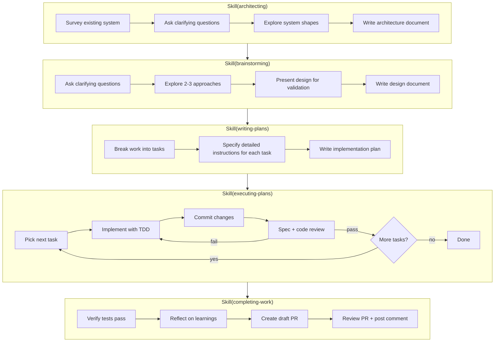

# claudefiles

My opinionated resources for working with [Claude Code](https://www.anthropic.com/claude-code).

## Features

- [Structured Development Workflow](#structured-development-workflow) - Reliably turn ideas into pull requests
- [Claude Worktree Manager (cwm)](#claude-worktree-manager) - Develop in parallel using Git worktrees and tmux
- [Integrations](#integrations) - Connect to external resources for seamless context

## Requirements

- [Claude Code](https://github.com/anthropics/claude-code)
- [Homebrew](https://brew.sh/) for macOS dependency management
- [Python 3](https://www.python.org/downloads/) for `cwm`
- macOS is assumed, but can be adapted for Linux

## Quick Start

```sh
git clone git@github.com:averycrespi/claudefiles.git
cd claudefiles
./setup.sh
```

The setup script will install dependencies, symlink configuration files to `~/.claude/`, and add scripts to your `PATH`.

---

## Structured Development Workflow

A workflow for reliably turning ideas into pull requests, adapted from [superpowers](https://github.com/obra/superpowers).

### Overview



### How to Use This Workflow

Ask Claude to architect or brainstorm your idea:

```
> You: Architect how we should restructure the notification system.
> Claude: Using Skill(architecting) ...

> You: Brainstorm how we can implement ticket ABC-123.
> Claude: Using Skill(brainstorming) ...
```

Answer Claude's questions as you proceed through the workflow.

### When to Use This Workflow

**Use the structured workflow** when:
- Building a significant feature that spans multiple files
- You want independent code reviews after each task
- The implementation would benefit from upfront design discussion
- You want a written plan you can review before execution

**Use Claude Code's built-in planning mode** when:
- Making smaller, well-defined changes
- The scope is clear and doesn't need exploration
- You want faster iteration with less ceremony

**Choosing an execution mode:**

When you choose to execute a plan, you'll be offered two modes:

| Mode                       | Best for                           | Trade-off                                   |
| -------------------------- | ---------------------------------- | ------------------------------------------- |
| **Execute with subagents** | Complex plans, autonomous work     | Slower but prevents context pollution       |
| **Execute quickly**        | Simple plans, interactive sessions | Faster but all work happens in main context |

Both modes use the same task triplet structure (Implement → Spec Review → Code Review) and the same review discipline. The difference is whether work happens in subagents or inline.

---

## Claude Worktree Manager

`cwm` (Claude Worktree Manager) provides commands for parallel development using Git worktrees and tmux:

| Command            | Purpose                                  |
| ------------------ | ---------------------------------------- |
| `cwm init`         | Create tmux session for repo             |
| `cwm add <branch>` | Create worktree + window + launch Claude |
| `cwm rm <branch>`  | Remove worktree + close window           |
| `cwm attach`       | Attach to tmux session for repo          |
| `cwm notify`       | Add bell to window (for hooks)           |

---

## Integrations

### Atlassian (Jira + Confluence)

Read and write access to Jira issues, Confluence pages, and Compass via the official Atlassian MCP server.

**Setup:**

1. Start Claude Code in any project
2. Run `/mcp` and select "Authenticate" for Atlassian
3. Complete OAuth flow in browser
4. Done - Jira and Confluence tools now available

**Capabilities:**
- **Jira:** Search, create, and update issues
- **Confluence:** Search, create, and update pages
- **Compass:** Query and create service components

**Requirements:**
- Atlassian Cloud account (Server/Data Center not supported)
- Internet connection for remote MCP server

### Datadog Logs

Search Datadog logs directly from Claude using the `searching-datadog-logs` skill.

**Setup:**

Store your Datadog API credentials in macOS Keychain:

```bash
security add-generic-password -s searching-datadog-logs -a api-key -w <YOUR_DD_API_KEY>
security add-generic-password -s searching-datadog-logs -a app-key -w <YOUR_DD_APP_KEY>
```

**Capabilities:**
- Search logs by query, service, status, time range
- Fetch full log details by ID
- Error-driven investigation from stack traces
- Exploratory search with query refinement

## Attribution

The workflow skills in this repository are adapted from [superpowers](https://github.com/obra/superpowers) by Jesse Vincent, licensed under MIT.

The `creating-skills` skill is adapted from [Anthropic's skill-creator](https://github.com/anthropics/skills/tree/main/skill-creator), licensed under Apache 2.0.

The status line script is adapted from [claude-code-tools](https://github.com/pchalasani/claude-code-tools) by Prasad Chalasani, licensed under MIT.

## License

- Repository licensed under [MIT](./LICENSE)
- Individual skills and agents may have their own licenses
