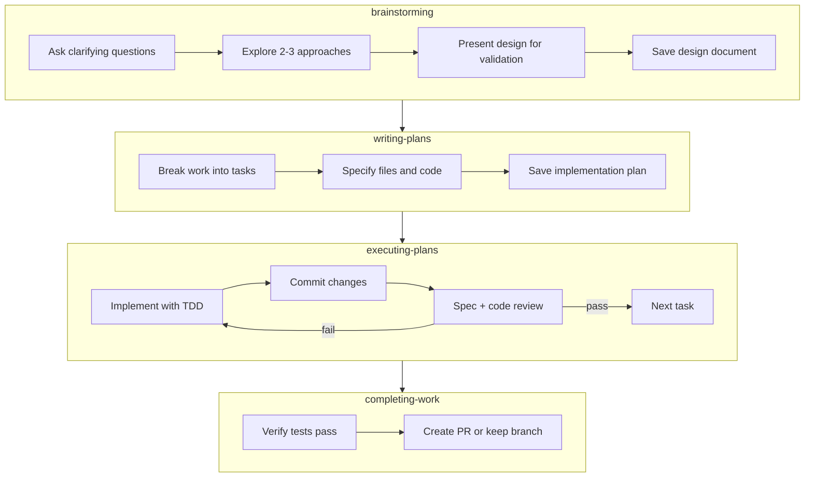

# claudefiles

My opinionated resources for working with [Claude Code](https://www.anthropic.com/claude-code).

## Features

- [Structured Development Workflow](#structured-development-workflow) - Reliably turn ideas into pull requests
- [Worktree Scripts](#worktree-scripts) - Develop in parallel using Git worktrees and tmux
- [Integrations](#integrations) - Connect to external resources for seamless context

## Requirements

- [Claude Code](https://github.com/anthropics/claude-code)
- [Homebrew](https://brew.sh/) for macOS dependency management
- [Bun](https://bun.sh/) for the status line
- macOS is assumed, but can be adapted for Linux

## Quick Start

```sh
git clone git@github.com:averycrespi/claudefiles.git
cd claudefiles
./setup.sh
```

The setup script will install dependencies, symlink configuration files to `~/.claude/`, configure MCP servers, and add scripts to your `PATH`.

---

## Structured Development Workflow

A workflow for reliably turning ideas into pull requests, adapted from [superpowers](https://github.com/obra/superpowers).

### Overview



### How to Use This Workflow

Use the integrations to load any relevant context:

```
> You: Read Jira ticket ABC-123.
> Claude: Using Skill(jira) ...
```

```
> You: Find and read the Confluence page for project XYZ.
> Claude: Using Skill(confluence) ...
```

Ask Claude to brainstorm your idea:

```
> You: Brainstorm how we can implement ticket ABC-123.
> Claude: Using Skill(brainstorming) ...
```

Answer Claude's question as you proceed through the workflow.

### When to Use This Workflow

**Use the structured workflow** when:
- Building a significant feature that spans multiple files
- You want independent code reviews after each task
- The implementation would benefit from upfront design discussion
- You want a written plan you can review before execution

**Use Claude Code's built-in planning mode** when:
- Making smaller, well-defined changes
- The scope is clear and doesn't need exploration
- You want faster iteration with less ceremony

---

## Worktree Scripts

Scripts for parallel development using Git worktrees and tmux:

| Script                       | Purpose                                                                     |
| ---------------------------- | --------------------------------------------------------------------------- |
| `worktree-init`              | Start a new tmux session for the current repository                         |
| `worktree-attach`            | Attach to the tmux session for the current repository                       |
| `worktree-add <branch-name>` | Create a new worktree and tmux window for a branch                          |
| `worktree-rm <branch-name>`  | Destroy the worktree and tmux window for a branch                           |
| `worktree-notify`            | Add notification bell to tmux window for the current branch (used by hooks) |

---

## Integrations

### Jira

Read-only access to Jira issues, boards, and sprints via the Atlassian CLI.

**Setup:**

```sh
acli jira auth login
acli jira auth status  # Verify authentication
```

For more information, see the [Jira skill README](./claude/skills/jira/README.md).

### Confluence

Search and read Confluence documentation.

**Setup:**

```sh
# Add to your shell profile (~/.zshrc, ~/.bashrc, etc.)
export CONFLUENCE_DOMAIN="mycompany.atlassian.net"
export CONFLUENCE_EMAIL="your.email@example.com"
export CONFLUENCE_API_TOKEN="your-api-token-here"
```

For more information, see the [Confluence skill README](./claude/skills/confluence/README.md).

## Attribution

The workflow skills in this repository are adapted from [superpowers](https://github.com/obra/superpowers) by Jesse Vincent, licensed under MIT.

The `creating-skills` skill is adapted from [Anthropic's skill-creator](https://github.com/anthropics/skills/tree/main/skill-creator), licensed under Apache 2.0.

## License

- Repository licensed under [MIT](./LICENSE)
- Individual skills and agents may have their own licenses
