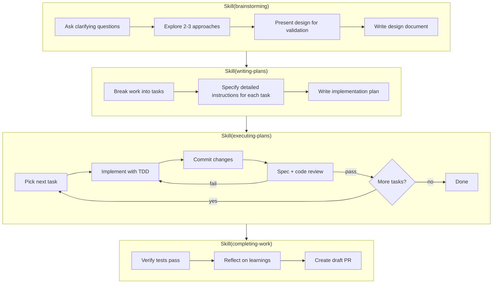

# Structured Development Workflow

A workflow for reliably turning ideas into pull requests, adapted from [superpowers](https://github.com/obra/superpowers).

## Overview



## How to Use

Ask Claude to brainstorm your idea:

```
> You: Brainstorm how we can implement ticket ABC-123.
> Claude: Using Skill(brainstorming) ...
```

Answer Claude's questions as you proceed through the workflow.

## When to Use This Workflow

**Use the structured workflow** when:
- Building a significant feature that spans multiple files
- You want independent code reviews after each task
- The implementation would benefit from upfront design discussion
- You want a written plan you can review before execution

**Use Claude Code's built-in planning mode** when:
- Making smaller, well-defined changes
- The scope is clear and doesn't need exploration
- You want faster iteration with less ceremony
