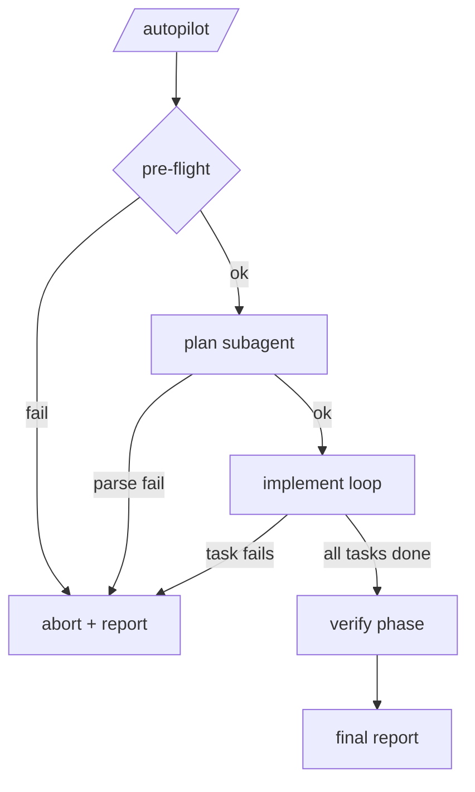
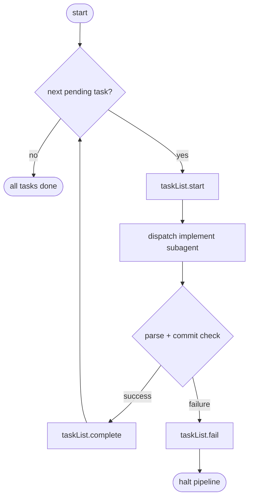
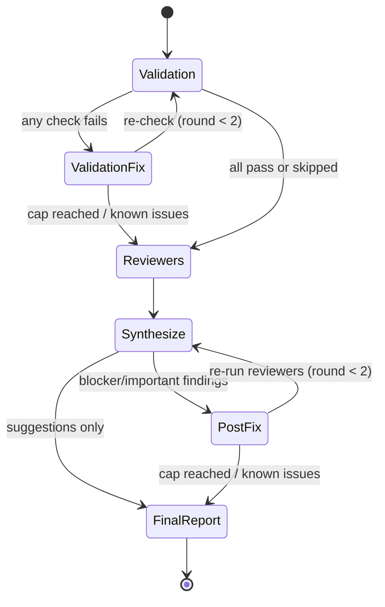
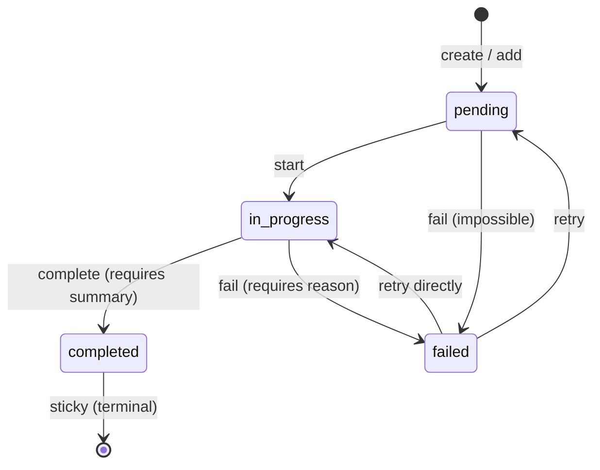

# autopilot

Pi extension that runs an autonomous plan → implement → verify pipeline from a design doc to a PR-ready branch.

## Command reference

### `/autopilot <design-file>`

One positional argument: the path to a design document (typically `.designs/YYYY-MM-DD-<topic>.md`). No flags in v1.

**Pre-flight checks** (run before any subagent is dispatched):

1. The design file exists and is readable.
2. The working tree is clean (no uncommitted or staged changes).
3. Capture the current `HEAD` SHA as the pipeline's base SHA (used for diffing during verify).

If any pre-flight check fails, the pipeline aborts immediately and prints a short reason. No branches are created or modified.

## Pipeline overview

The orchestrator is a single `async` TypeScript function that sequences three phases — **plan**, **implement**, **verify** — and always ends by printing a final report. No LLM runs in the main session during the pipeline; every LLM call is a fresh subagent dispatched via the `subagents` extension.



_Caption: Top-level pipeline flow. Any parse or implement failure routes to the final report with partial state; the pipeline never hangs._

## Phase reference

### Plan

**What it does.** Reads the design doc and produces an implementation plan: a short `architecture_notes` blob plus an ordered list of 1–15 outline-level tasks.

**Subagent prompt.** See `prompts/plan.md`. The prompt substitutes `{DESIGN_PATH}` and enforces the "outline-level tasks, no TDD steps, no code, no sub-bullets" contract designed for GPT-5-class models.

**Output schema:**

```json
{
  "architecture_notes": "string (<=200 words)",
  "tasks": [{ "title": "string", "description": "string" }]
}
```

**Orchestrator responsibilities.**

1. Dispatch the plan subagent once.
2. `parseJsonReport(output, PlanReportSchema)`.
3. On parse or validation failure → abort the pipeline.
4. On success → `taskList.create(tasks)` and move to implement.

**Caps & failure modes.** No retry. A malformed plan aborts the pipeline immediately.

### Implement

**What it does.** Walks the task list in order. For each pending task, dispatches a fresh implement subagent with `architecture_notes` + that task's description only. Parses the structured report, verifies a commit landed, and moves to the next task. First failure halts the pipeline.

**Subagent prompt.** See `prompts/implement.md`. Key GPT-5 guardrails: "do only what this task describes", "do not re-read or re-edit files you've already handled", "STOP, end your turn" on blocked tasks.

**Output schema:**

```json
{
  "outcome": "success | failure",
  "commit": "<sha> | null",
  "summary": "string"
}
```

**Orchestrator responsibilities.**

1. `taskList.start(task.id)` and set activity line to `"dispatching subagent…"`.
2. Record `pre-task HEAD`.
3. Dispatch one subagent with the filled prompt.
4. `parseJsonReport(output, ImplementReportSchema)`.
5. Verify a new commit landed: `git rev-list <pre-task-head>..HEAD --count >= 1`.
6. On success → `taskList.complete(id, summary)`.
7. On parse failure, `outcome: "failure"`, or missing commit → `taskList.fail(id, reason)` and **break** the loop.

**Caps & failure modes.** No per-task retry. Any task failure halts the pipeline; later tasks are never attempted.



_Caption: Per-task implement loop. Tasks run sequentially; a single failure halts the pipeline — no retries, no skipping ahead._

### Verify

**What it does.** Five steps:

1. **Validation** — a validation subagent discovers and runs the project's tests, lint, and typecheck. If any category fails, a fixer subagent addresses the failure and validation is re-run. **Cap: 2 fix rounds.**
2. **Parallel reviewers** — three reviewer subagents (`plan-completeness`, `integration`, `security`) run in parallel, one shot each, over the pipeline's full diff.
3. **Synthesize** — orchestrator drops findings with confidence < 80, dedupes by file-and-line proximity, and triages: `blocker` + `important` → fix loop; `suggestion` → known issues.
4. **Post-reviewer fix loop** — fixer subagent resolves blockers and importants; reviewers re-run on the post-fix diff. **Cap: 2 fix rounds.** Anything still present becomes a known issue.
5. **Final report** — printed; pipeline ends.

**Subagent prompts.** `prompts/reviewer-plan-completeness.md`, `prompts/reviewer-integration.md`, `prompts/reviewer-security.md`, `prompts/fixer.md`, and the inline validation prompt in `phases/verify.ts`.

**Output schemas.** `ValidationReportSchema`, `ReviewerReportSchema`, `FixerReportSchema` — all validated via `parseJsonReport`.

**Orchestrator responsibilities.** Detect all fix-loop exits, flag partial results as known issues, and always proceed to the final report. Verify never loops back into implement.

**Caps & failure modes.** Both fix loops are capped at 2 rounds. A failed reviewer is silently skipped and noted in the report. A fixer that introduces a new regression does not trigger rollback — the regression becomes a known issue.



_Caption: Verify phase with two capped fix loops (validation at most 2 rounds, post-reviewer at most 2 rounds). When a cap is hit, remaining issues become known issues and the pipeline still proceeds to the final report — there is no loopback into the implement phase._

## Task state machine

The orchestrator drives every transition on the shared `task-list` API. Valid transitions are enforced by the API and throw on illegal moves.



_Caption: Task states and transitions. **Completion is sticky** — once a task reaches `completed`, there is no edge out. This is the anti-perfectionism nudge that lets the pipeline actually finish instead of re-opening "done" work._

## Subagent output contract

Every subagent (plan, implement, validation, reviewers, fixer) returns its report as a **strict JSON object** matching a per-subagent TypeBox schema. One parser, one validation path, no ad-hoc delimiters.

All subagent prompts end with the shared suffix:

```
Output ONLY the JSON object. No prose before or after. No markdown code fences.
```

The orchestrator uses a shared helper:

```ts
parseJsonReport<T>(output: string, schema: TSchema):
  | { ok: true, data: T }
  | { ok: false, error: string }
```

It strips common wrappers (leading/trailing prose, ` ```json ... ``` ` fences), `JSON.parse`s the stripped content, then validates against the schema. Any parse or validation error yields `{ ok: false, error }` with a concise description. Each phase specifies what to do on `ok: false` — typically "treat as failure for this subagent, do not retry".

## Failure matrix

Unified principle: **always terminate with a report. Never leave the user in a stuck state.**

| Failure                                                  | Handling                                                                              |
| -------------------------------------------------------- | ------------------------------------------------------------------------------------- |
| Plan subagent returns invalid/unparseable output         | Abort pipeline. No branch changes. Report.                                            |
| Implement subagent fails on task N                       | Stop pipeline. Tasks 1..N-1 remain committed. Tasks N+1..end never attempted. Report. |
| Verify automated checks still failing after 2 fix rounds | Pipeline still completes. Checks flagged as known issues in report. User gets branch. |
| Reviewer subagent fails to run                           | Orchestrator skips that reviewer. Skip noted in report. Other reviewers still run.    |
| Fix subagent breaks something that was passing           | Record as known issue. Do not roll back.                                              |
| Dirty working tree at `/autopilot` invocation            | Abort immediately before plan phase.                                                  |

No implicit retries (beyond the explicit fixer loops). No implicit rollbacks. Every commit that lands during the pipeline stays on the branch.

## Final report

Printed as a single transcript message at pipeline end:

```
━━━ Autopilot Report ━━━

Design:  .designs/2026-04-12-rate-limiter.md
Branch:  workflow  (5 commits ahead of main)

Tasks (5/5):
  ✔ 1. Add rate limiter config          (abc1234)
  ✔ 2. Wire config into middleware      (def5678)
  ✔ 3. Add tests for rate limiter       (ghi9012)
  ✔ 4. Add IP-based rate limit key      (jkl3456)
  ✔ 5. Update README                    (mno7890)

Verify:
  Automated checks:  ✔ tests  ✔ lint  ✔ typecheck
  Reviewers:         plan-completeness  integration  security
  Fixed:             2 findings  (1 blocker, 1 important)
  Known issues:      1 suggestion
    └ src/middleware.ts:42 | suggestion | rate limit could be extracted to a helper

Next:
  Review the branch, run /push or gh pr create when ready.
```

Reading the blocks:

- **Design / Branch** — what ran and where the work landed. The branch is whatever the user had checked out at invocation; autopilot never switches branches.
- **Tasks** — one row per planned task with its glyph (`✔` done, `✗` failed, `◻` not attempted) and the commit SHA that implemented it.
- **Verify → Automated checks** — results of the validation subagent, possibly after up to 2 fix rounds.
- **Verify → Reviewers** — which reviewers ran (a skipped reviewer is listed with a `(skipped)` suffix).
- **Verify → Fixed** — what the post-reviewer fix loop resolved.
- **Verify → Known issues** — everything the pipeline deliberately left for the human: low-severity suggestions, findings that survived the fix cap, validation failures that survived the fix cap, and regressions the fixer introduced.
- **Next** — a nudge, not an action. Autopilot does not push, does not open PRs, does not switch branches.

**Report variants.** On implement failure on task N, tasks 1..N-1 are `✔`, task N is `✗` with its failure reason, tasks N+1..end are `◻`, and the verify section is replaced with `skipped (implement failed)`. On verify partial, unresolved findings appear under known issues.

## How it works

- **Orchestrator is code, not an LLM.** `/autopilot` is implemented as an `async` TypeScript function that sequences subagent dispatches and state updates programmatically. Keeping the orchestrator deterministic means the pipeline's control flow — caps, failure routing, commit verification — is not itself subject to LLM drift.
- **One subagent per unit of work.** Each task gets its own fresh implement subagent with no shared context. This resets the perfectionism ratchet between tasks and exploits the instruction-literalist strength of GPT-5-class models: a single crisply-scoped task per fresh context.
- **Sequential implement, parallel reviewers.** Implement runs one task at a time so each task's base SHA is predictable and concurrent subagents don't collide on merge conflicts. Reviewers run in parallel because they're read-only and independent — no shared write state, no ordering hazards.
- **No loopback from verify.** Verify never re-opens the implement phase. A failing check after two fix rounds becomes a known issue and the pipeline still completes. The alternative — "keep going until verify is clean" — is the exact open-ended loop that GPT-5 thrashes in.
- **Every commit sticks.** There is no rollback path. If the fixer breaks something that was passing, that's a known issue on the user's branch, not a revert. The user always gets _something_ to look at.

## Inspiration

- `tmustier/pi-extensions/ralph-wiggum` — iterative loop pattern with periodic reflection checkpoints
- `klaudworks/ralph-meets-rex` — plan → implement → verify three-phase pipeline with loopback routing
- `ruizrica/agent-pi` — declarative YAML pipelines, role specialization, multi-model fan-out
- `davidorex/pi-project-workflows` — DAG execution engine with schema-validated step boundaries
- `tmdgusya/roach-pi` — phase-gated state machine (clarify → plan → build → review), depth-capped subagent spawning
- Claude Code's `executing-plans` skill — task triplet structure (implement → spec review → code review) and subagent dispatch per phase
- Claude Code's `verifying-work` skill — parallel reviewers, confidence filtering, auto-fix vs ambiguous triage
