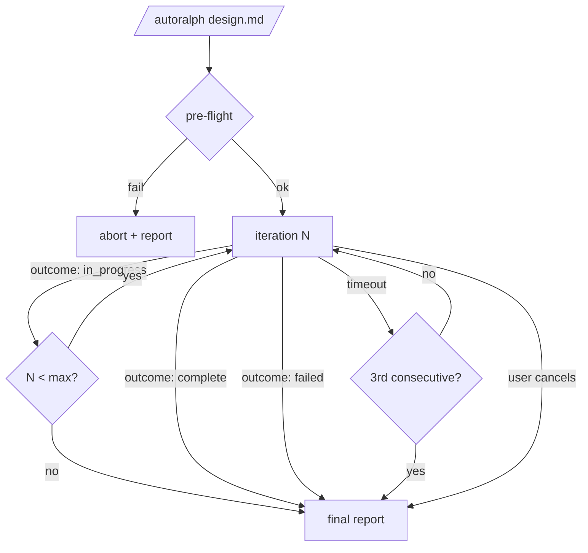

# autoralph

A Pi extension that runs an autonomous, agent-driven Ralph-style loop on a design document until the agent declares it complete.

## Purpose

Autoralph exists as a sibling to `/autopilot` so the same design doc can be run through both pipelines and the outcomes compared. Same input, two fundamentally different control structures.

## Comparison rationale

|                     | autopilot                                               | autoralph                                                              |
| ------------------- | ------------------------------------------------------- | ---------------------------------------------------------------------- |
| Control flow        | Deterministic TS orchestrator dictates every transition | Agent-driven; orchestrator just dispatches and counts iterations       |
| Phase structure     | plan → implement loop → verify                          | bootstrap → iteration loop (no plan, no verify)                        |
| Per-step contract   | One subagent per planned task; commit required          | One subagent per iteration; commits encouraged, not required           |
| Memory across steps | None — every implement subagent gets a cold context     | Cold subagent + agent-curated handoff blob + persistent task file      |
| Termination         | All planned tasks done                                  | Agent emits `outcome: "complete"`, max iterations hit, or user cancels |
| Verify              | Validation + 3 parallel reviewers + capped fix loops    | None — the loop self-validates                                         |
| Reflection          | N/A                                                     | Optional special prompt every N iterations (default every 5)           |

**Shared with autopilot (intentional, for comparison parity):**

- Same invocation shape: `/autoralph <design.md>` reads a `.designs/YYYY-MM-DD-*.md` doc.
- Same preflight: design exists, working tree clean, capture base SHA.
- Same single-active-run lock with `/autoralph-cancel`.
- Same status widget pattern (sticky widget above the editor, live subagent activity).
- Same final-report style at run end.
- Same "no push, no PR, no branch switching" boundary.

**The comparison thesis.** Autopilot bets on structure (plan upfront, decompose, verify after). Autoralph bets on iteration (let the agent figure it out as it goes, with curated continuity). Running both on the same design doc tells us which bet pays off.

## Command surface

```
/autoralph-start <design-file> [--reflect-every N] [--max-iterations N] [--iteration-timeout-mins N]
/autoralph-cancel
```

- `<design-file>` — path to a design doc (typically `.designs/YYYY-MM-DD-<topic>.md`). Required.
- `--reflect-every N` — override reflection cadence. Default `5`. Pass `0` to disable.
- `--max-iterations N` — hard cap on iterations. Default `50`.
- `--iteration-timeout-mins N` — wall-clock budget per iteration. Default `15`. Subagent gets aborted if exceeded.

Single active run at a time. Invoking `/autoralph-start` while one is in progress errors immediately. `/autoralph-cancel` aborts via the run-level `AbortController` (same pattern as `/autopilot-cancel`).

## Pre-flight checks

Identical to autopilot:

1. Design file exists, is a regular file, and is non-empty.
2. Working tree is clean (`git status --porcelain` empty).
3. Capture current `HEAD` SHA as the run's base SHA.

Failing any check aborts before any subagent dispatches. No `~/.pi/workflow-runs/autoralph/<run-id>/` directory created.

## Operational guardrails

Two defenses against single-iteration context overflow / runaway behavior:

1. **Prompt guardrails baked into the iteration prompt.** Same family autopilot's implement prompt uses:

   > "Do one focused chunk of work this iteration. Don't re-read files you've already touched in this iteration. When you've made forward progress (or determined you're blocked), write your handoff and end your turn."

2. **Wall-clock timeout per iteration.** Each iteration dispatch is wrapped in a `setTimeout(controller.abort, timeoutMs)`. On timeout the iteration is recorded as `outcome: "timeout"`, the handoff blob from that iteration is lost, and the loop continues with the prior iteration's task file + handoff intact. Three consecutive timeouts halt the loop as `stuck`.

Skipped for v1 (can add later if real failures show up): items-per-iteration hint, large-context-model default, task file size budget, structured context-overflow detection.

## Pipeline overview



## Storage layout

Created lazily on iteration 1:

```
~/.pi/workflow-runs/autoralph/<run-id>/workflow/
  <slug>.md             # the agent's working task file
  <slug>.handoff.json   # last iteration's handoff blob
  <slug>.history.json   # append-only iteration log
```

`<slug>` is derived from the design file path (e.g. `.designs/2026-04-20-rate-limiter.md` → `2026-04-20-rate-limiter`). `history.json` becomes the data the final report draws from.

## Iteration phase

**Single phase. One template, conditional sections.**

```
You are iteration {N} of {MAX} of an autoralph loop.

Design document (verbatim path): {DESIGN_PATH}
Working task file: {TASK_FILE_PATH}
{IF iteration === 1:}
This is iteration 1. The task file does not yet exist — read the design,
create {TASK_FILE_PATH} with goals + a checklist + initial notes, then
begin work.
{ELSE:}
Prior iteration's handoff: {HANDOFF_JSON}
Read {TASK_FILE_PATH} (your prior notes), then continue from the handoff.
{END}

{IF this is a reflection iteration:}
REFLECTION CHECKPOINT — before continuing work, update the task file with
your answers to: what's done, what's working, what's blocking, should the
approach change, what are the next priorities?
{END}

Do one focused chunk of work. Don't re-read files you've already touched
this iteration. Commit when you have something coherent (conventional
commit, imperative mood, <50 chars). Update the task file. Write your
handoff. End your turn.

Output ONLY this JSON object (no prose, no fences):
{
  "outcome": "in_progress" | "complete" | "failed",
  "summary": "<one sentence>",
  "handoff": "<free-form notes for the next iteration: what you just did,
              what you tried that didn't work, what to do next>"
}
```

**Per-iteration orchestrator responsibilities:**

1. Build prompt with current iteration number, reflection flag, prior handoff.
2. Capture `HEAD` SHA before dispatch.
3. Dispatch subagent (tools: `read`/`write`/`edit`/`bash`; extensions: `format`) with the iteration-timeout abort timer wrapped around the run-level signal.
4. Parse JSON report via `parseJsonReport` (same helper autopilot uses).
5. Append `{iteration, outcome, summary, headBefore, headAfter, durationMs}` to `history.json`.
6. Write `handoff` to `<design-basename>.handoff.json` for the next iteration to read.
7. Branch on outcome (advance, terminate, or count toward consecutive-timeout cap).

**Why the agent owns the task file rather than the orchestrator.** Keeps the format flexible — the agent decides what shape its working notes take, and the orchestrator never parses the file. Mirrors ralph-wiggum's choice.

**Why the handoff is free-form text.** Same reasoning: the agent decides what's worth carrying forward (recent attempts, blockers, planned next steps) without being constrained to specific JSON sub-fields.

## Status widget

Sticky widget keyed `autoralph` (same mechanism as autopilot):

```
autoralph · iter 7/50 · 12:34
  ↳ Iteration 7 (1:42)
     - editing src/middleware/rate-limit.ts
     - running pnpm test
     - committing rate-limit changes
  history: 6 done (4 commits) · 0 timeouts
    ✔ 5. add basic rate limiter scaffold (abc1234)
    ✔ 6. wire config + tests          (def5678)
    ◼ 7. in progress…
type /autoralph-cancel to stop
```

Two differences from autopilot's widget:

- Header replaces the `plan › implement › verify` breadcrumb with `iter N/MAX`.
- Body's task-window-with-status-glyphs is replaced with an iteration-window: last two completed iterations (with commit SHA if any), the in-progress one, plus running counts (`6 done (4 commits) · 0 timeouts`).

Reflection iterations get a `🪞` glyph next to the iteration number.

Everything else is identical: `↳ <intent> (MM:SS)` for the live subagent, last 1–3 tool events under it, dimmed footer with the cancel command, theme colors via the shared `WidgetTheme` interface. Reuses `createSubagentActivityTracker` and the existing widget tick infrastructure verbatim.

## Final report

Printed at run end, regardless of outcome:

```
━━━ Autoralph Report ━━━

Design:  .designs/2026-04-20-rate-limiter.md
Branch:  workflow  (4 commits ahead of main)
Outcome: complete  (after 7 iterations, 14:22 elapsed)

Iterations (7):
  ✔  1. bootstrap: read design, write task file       (no commit)
  ✔  2. add rate limiter config + types               (abc1234)
  ✔  3. wire config into middleware                   (def5678)
  ✔  4. add IP-based key extraction                   (ghi9012)
  🪞 5. reflection: noted test gap, adjusted plan     (no commit)
  ✔  6. add tests for rate limiter                    (jkl3456)
  ✔  7. update README + handoff: complete             (mno7890)

Final task file: ~/.pi/workflow-runs/autoralph/<run-id>/workflow/2026-04-20-rate-limiter.md
Final handoff:   "All checklist items complete; tests passing locally."
```

**Outcome variants:**

- `complete` — agent emitted `outcome: "complete"`.
- `max-iterations` — hit `--max-iterations` cap; loop ended without a complete signal.
- `failed` — agent emitted `outcome: "failed"`; reason from the last summary.
- `stuck (3 consecutive timeouts)` — wall-clock cap tripped repeatedly.
- `cancelled` — `/autoralph-cancel` invoked; banner shows elapsed time.

Same parity boundary as autopilot: no push, no PR, no branch switching.

## Failure matrix

Same unified principle: **always terminate with a report. Never leave the user in a stuck state.**

| Failure                                                   | Handling                                                                                                                                                                                  |
| --------------------------------------------------------- | ----------------------------------------------------------------------------------------------------------------------------------------------------------------------------------------- |
| Pre-flight check fails                                    | Abort before any subagent dispatches. Print short reason. No `~/.pi/workflow-runs/autoralph/<run-id>/` directory created.                                                                 |
| Iteration subagent dispatch crashes/times out (transport) | Retry once, intent suffixed with `(retry)`. Mirrors autopilot. If retry also fails → record as failed iteration, continue loop with prior state.                                          |
| Iteration subagent returns invalid/unparseable JSON       | No retry — parse failures are systematic. Record as failed iteration with `summary: "invalid report: <error>"`, advance loop. Handoff lost; next iteration restarts from prior task file. |
| Iteration subagent reports `outcome: "failed"`            | Loop halts immediately. Final report shows the failure summary.                                                                                                                           |
| Iteration subagent reports `outcome: "complete"`          | Loop ends cleanly. Final report → `Outcome: complete`.                                                                                                                                    |
| Wall-clock timeout (per-iteration)                        | Subagent aborted. Recorded as `outcome: "timeout"`. Handoff lost; next iteration uses prior handoff + current task file. Three consecutive timeouts halt the loop as `stuck`.             |
| Hit `--max-iterations` cap                                | Loop ends. Final report → `Outcome: max-iterations`. Branch retains all commits that landed; no rollback.                                                                                 |
| `/autoralph-cancel` mid-run                               | Abort current subagent. Skip any pending retry. Emit final report with `cancelled` banner and elapsed time.                                                                               |
| User Ctrl-C / process dies                                | `~/.pi/workflow-runs/autoralph/<run-id>/workflow/<slug>.{handoff,history}.json` are on disk — the user can inspect state. No automatic resume in v1.                                      |

### Retry policy

Mirrors autopilot's: exactly **one retry**, only for dispatch-transport failures, only when the first attempt's `aborted` flag is false and the run-level signal isn't already aborted. Parse failures, `outcome: "failed"`, and timeouts are _not_ retried.

### Two intentional divergences from autopilot

1. **Parse failure mid-loop is recoverable.** Autopilot aborts on plan parse failure because there's nothing downstream. Autoralph just records the failed iteration and continues — the next iteration reads the task file and prior handoff, ignorant of the parse miss. The loop is robust to one bad iteration.

2. **No verify-phase fix loops.** The loop itself is the fix mechanism — if the agent notices a problem in iteration 8, it addresses it in iteration 9 via its own checklist. This is the most direct embodiment of the "agent-driven vs structured" comparison.

**No rollback.** Same reasoning as autopilot: every commit that lands stays on the branch.

## Module layout

Mirrors `pi/agent/extensions/autopilot/` so the comparison code-reads the same way:

```
pi/agent/extensions/autoralph/
  README.md
  index.ts
  index.test.ts
  lib/
    args.ts
    args.test.ts
    schemas.ts
    state.ts
    state.test.ts
    report.ts
    report.test.ts
    widget-body.ts
    widget-body.test.ts
  phases/
    iterate.ts
    iterate.test.ts
  prompts/
    iterate.md
    reflection-block.md
```

**Builds on `_workflow-core`.** Autoralph now mirrors autopilot's post-migration foundation: `_workflow-core/` provides `registerWorkflow`, `Subagent`, `Widget`, and report helpers; autoralph supplies its own iteration loop, history+handoff persistence (`lib/state.ts`), and iteration-aware widget body (`lib/widget-body.ts`).

## Testing

Same approach autopilot uses: pure-logic units tested via `node:test` + `tsx`. Tests cover:

- Prompt template substitution (iteration number, reflection flag, handoff injection).
- JSON parse paths (`IterationReportSchema` happy + malformed).
- History append semantics (append-only, atomic write).
- Handoff round-trip + bootstrap detection.
- Widget render shape (header, iteration window, reflection glyph).
- Preflight (vendored — re-run autopilot's tests).
- Iteration timeout abort behavior (fake timers).

Run via `make test` and `make typecheck` per repo convention.

## Inspirations

- [tmustier/pi-extensions/pi-ralph-wiggum](https://github.com/tmustier/pi-extensions/tree/main/pi-ralph-wiggum) — primary prior art for the loop pattern (state file format, completion marker, reflection cadence). Diverges by running in subagents instead of main session and curating warmth via handoff blob instead of warm context.
- Geoffrey Huntley's original "Ralph Wiggum" pattern — the bare loop idea; the no-reflection baseline we're testing against by allowing `--reflect-every 0`.
- `pi/agent/extensions/autopilot` (sibling) — every UX surface and runtime contract is borrowed directly so the two are A/B-testable.
