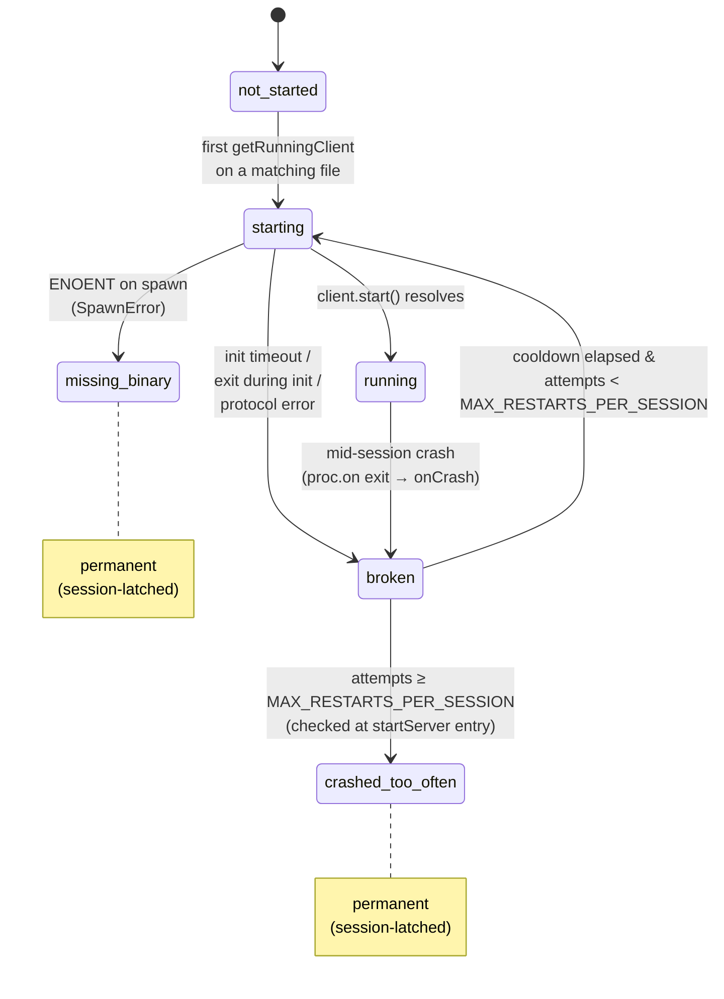

# code-feedback — design notes

Durable architectural context for future maintainers. The what/how is in
the code itself and the README; this file captures the why.

## Non-goals for v1

The following are intentionally out of scope. They're all straightforward
to add later, but each adds complexity that wasn't justified for the
initial version:

- **No `.pi-lsp.json` config file** — languages are hardcoded in
  `lsp/servers.ts`. Adding a language is a code change.
- **No tree-sitter fallback** — when LSP is unavailable the extension
  surfaces a clear error instead of degrading to a different engine.
- **No LSP-based formatting** — format stays on the CLI shell-out path
  (`gofmt`, `prettier`). See "Why CLI formatters" below.
- **No auto-install of language servers** — missing `gopls` or
  `typescript-language-server` produces an install hint, not a download.
- **No completions, rename, or code actions** — the `lsp_navigation`
  tool stops at read-only navigation features.
- **No slash commands** — no `/lsp-status`, `/lsp-restart`, etc.
- **No workspace-wide `lsp_diagnostics`** — `path: "*"` was tried and
  removed. See "Why no workspace-wide diagnostics" below.

## Why one unified extension (not two)

Format and LSP must run in a specific order on every `write`/`edit`:

1. Autoformat runs first — file bytes may change
2. Content is re-read from disk
3. LSP `didChange` with the post-format content
4. Wait for diagnostics
5. Append errors (if any) to the tool result

If format and LSP lived in separate Pi extensions, the ordering would
depend on Pi's listener invocation order — fragile. A single extension
with one `tool_result` handler sequences them deterministically.

## Why no workspace-wide diagnostics

An earlier version of `lsp_diagnostics` accepted `path: "*"` and
returned whatever the LSP had cached across all currently-tracked
files. The affordance was removed because every realistic code path
made it worse, not better:

- **Cold-start failure.** The most common way the model reached for
  `*` was at session start — before it had touched any file — hoping
  for a "what's broken in this repo" snapshot. The LSP had nothing
  tracked, so the tool returned "no files have been opened yet."
  The model was paying a tool call for a non-answer. Worse, it was
  being trained to reach for the affordance first.
- **Stale for the useful case.** When files _were_ tracked, the
  returned diagnostics were whatever was last cached — possibly from
  an auto-inject an hour ago, with no refresh. The model read them as
  current state and acted on outdated info.
- **Duplicated bad options for the good case.** Actually getting
  workspace-wide diagnostics right means one of:
  (a) Sending `workspace/diagnostic` per server — works for gopls,
  weak for tsserver (whose "workspace" is still the set of opened
  files), and gives nothing for push-only servers.
  (b) Pre-opening every matching file in the workspace tree — blows
  up tsserver's open-file set, slow for large repos, violates the
  "reads are cheap" contract the read-path observes.
  (c) Shelling out to `tsc --noEmit` / `go build ./...` / `go vet
./...` / `cargo check` — reliable, but it's _exactly_ what the
  model can already do via bash in one call, with no per-toolchain
  parser for us to maintain.

Option (c) is the best answer, and the model already has it — via
bash. Wrapping it in an LSP tool would add a format-consistency win
and a one-line discoverability win, in exchange for maintaining
per-toolchain output parsers and committing the model to our
opinionated subset of flags. Not worth it.

The compromise is documentation. `lsp_diagnostics`'s description
explicitly points at bash compiler invocations for whole-project
checks, so the model's mental model is "single-file LSP vs.
whole-project compiler" rather than "there's a workspace mode
somewhere."

If this decision is revisited, the current cache-read behavior is
almost never the thing to re-add. The choice is between (a) a real
`workspace/diagnostic` implementation gated on server capability —
useful primarily for Go — or (c) a compiler shell-out wrapped in a
tool, with a per-language output parser.

## Why CLI formatters instead of LSP formatting

Every reference implementation reviewed during design (Claude Code,
`pi-lens`, `pi-lsp-extension`) reached the same conclusion. Reasons:

- Not all language servers implement `textDocument/formatting` (tsserver
  mostly doesn't).
- CLI formatters are faster to spawn for one-shot use than booting an
  LSP server just to format.
- The CLI ecosystem (`gofmt`, `prettier`, etc.) is mature and
  well-understood.
- LSP formatting would complicate the `didChange` version chain since
  the formatter would mutate bytes behind the tracker's back.

## Lazy-start with return-null

When the model edits a file whose language server isn't running yet,
the orchestrator kicks off `startServer` in the background and
immediately returns — the model gets its tool result back instantly
with no LSP output. From the next edit onwards, the server is warm
and diagnostics appear normally.

This means the very first edit in a session never sees LSP errors.
Acceptable for our use case: the model is unlikely to make a critical
error on the first file it touches, and subsequent edits (or an
explicit `lsp_diagnostics` call) catch it. The alternative — blocking
the tool result for up to 10 seconds while tsserver warms up — would
be much worse.

Note that the explicit `lsp_diagnostics` tool uses a different policy:
if the model asked for diagnostics directly, it blocks with a timeout
(`EXPLICIT_TOOL_BLOCK_TIMEOUT_MS`) rather than silently returning
empty. That's appropriate because the model is asking on purpose.

## When files get opened

Language servers fall into two camps for how they learn about files:

- **Workspace indexers** (gopls, rust-analyzer, jdtls) — read the
  whole project during `initialize`. By the time the init handshake
  returns, the server already knows every file it cares about, and
  explicit `textDocument/didOpen` notifications mostly just mark a
  file as "in active editing" for buffered-content tracking.
- **Open-file-first servers** (tsserver, pyright) — don't know about
  a file until someone sends `didOpen` for it. Any request that
  references an unopened URI is rejected: tsserver responds with
  "Unexpected resource" for file-specific requests and "No Project"
  for workspace-wide requests, because in its model a "project" is
  created lazily from the first opened file that lands inside a
  `tsconfig.json` ancestor tree.

The extension handles this by opening files in exactly three
situations:

1. **After a successful `write` or `edit`** — the auto-inject path
   in `index.ts` reads the post-format content and calls
   `FileSync.syncWrite`, which sends `didOpen` on first touch or
   `didChange` thereafter.
2. **When `lsp_diagnostics` is called on a single file** — the tool
   calls `FileSync.openForQuery` before `client.getDiagnostics`,
   which stats, reads, and routes through `syncWrite`.
3. **When `lsp_navigation` is called on a file** — same pattern,
   before any `definition` / `references` / `hover` / `documentSymbol`
   request.

The common thread: we only open files when the model has signalled
intent. Writes/edits mean "I care about this file's correctness";
calling an LSP tool by name means "I want semantic info about this
file". Plain `read` tool calls deliberately do NOT open documents —
reads are cheap and frequent, and spawning or waking a language
server every time the model glances at a file would burn indexing
time for payoff that often never comes. The tradeoff is that the
very first semantic operation on a fresh TypeScript file incurs a
small `didOpen` round trip, but that's dwarfed by the server's own
processing time and happens exactly once per file per session
(subsequent queries re-route through `didChange`).

### Read-path cache piggyback

Reads still deliberately don't _open_ files, but when the model reads
a file that happens to be already tracked (from a prior write/edit
or explicit LSP tool call) we surface the LSP's cached diagnostics
alongside the read result. This is a strict cache lookup:
`FileSync.isTracked` filters out untouched files; on a hit we read
`client.getCachedDiagnostics(uri)` and format through the same
`formatAutoInjectSummary` the write/edit path uses. No `didOpen`, no
`didChange`, no `getDiagnostics` request, no wait — the feedback is
whatever the server last told us.

The motivation is that the model frequently re-reads a file after
editing it (to double-check context, reason about a diff, or compare
sections) and auto-inject's output has already scrolled out of the
visible conversation window. Re-surfacing the cached errors on the
re-read gives the model a nudge without costing anything. It also
catches the case where an external agent or script mutated a file
the LSP has seen — the cache may be stale relative to disk, but it's
still better signal than nothing.

The feature is deliberately scoped to the cache hit. Opening a file
on read would reintroduce exactly the "reads trigger server work"
problem the original rule exists to avoid — and would be especially
bad for `tsserver`, which is an open-file-first server that grows its
in-memory project set on every `didOpen`. Files the model reads but
has never edited remain invisible to the LSP, and that is intentional.

`FileSync.openForQuery` silently no-ops when the file is over
`LSP_MAX_FILE_BYTES` or can't be read, so the caller's LSP request
still runs against whatever state the server already has. That
preserves the "explicit tools should always attempt a response"
contract even when the file-open step fails.

## Diagnostic acquisition: pull with push fallback

LSP 3.17 added `textDocument/diagnostic` as a synchronous
request/response: the client asks "are you done? what are the errors?"
and the server responds when its analysis is complete. Both `gopls` and
`typescript-language-server` support it, so that's the preferred path.

For language servers that don't advertise `diagnosticProvider`, we fall
back to the traditional `publishDiagnostics` notification model with
a debounce (catch the syntax pass followed by the semantic pass) and
a hard cap (never wait forever). The push-mode strategy:

- Wait up to `PUSH_FIRST_NOTIFICATION_TIMEOUT_MS` for any
  `publishDiagnostics` to arrive for this URI
- Once one arrives, debounce `PUSH_DEBOUNCE_MS` to catch the semantic
  follow-up pass
- Never exceed `PUSH_HARD_TIMEOUT_MS` total
- Return whatever's in the diagnostic cache

Exact values are in `timing.ts` with reasoning in the JSDoc comments.

## Error surfacing policy

**Auto-inject (after every write/edit): errors only.** Warnings, info,
and hints are explicitly excluded. The reasoning — and how to re-enable
warnings if you change your mind — is documented in detail on
`AUTO_INJECT_SEVERITIES` in `constants.ts`.

**Explicit `lsp_diagnostics` tool: all severities.** When the model is
asking on purpose it wants the full picture.

**Missing-binary / crashed-too-often: silent in auto-inject.** If the
model edits a Go file and `gopls` isn't installed, we don't append
"gopls not installed" to every Go edit — that's context spam the
model can't act on. The user sees a one-time notification and a status
line indicator; the model finds out only if it explicitly calls
`lsp_diagnostics` or `lsp_navigation`.

## Command resolution: workspace-local before `$PATH`

Servers opted in via `ServerConfig.localBin` are resolved against
per-project bin directories before `$PATH`. v1 supports `"node"`, which
walks up from the workspace root looking for
`<dir>/node_modules/.bin/<command>` and takes the first hit.

The motivation is `typescript-language-server`. It's commonly installed
as a dev dependency alongside a pinned `typescript` version, and a
global install can resolve a different `typescript` package at runtime
than the repo's own compiler — producing diagnostics that disagree with
`tsc` in the repo. Preferring the local bin keeps LSP feedback
consistent with the project's toolchain and also makes the common
"`npm install --save-dev typescript-language-server`" setup work with no
global install.

The walk starts at the workspace root (not the file directory) so
monorepos with hoisted dependencies are handled naturally: if packages
live under `packages/foo/` but `node_modules/` is at the monorepo top,
`resolveRoot` finds `packages/foo/` first (via its own `tsconfig.json`
or `package.json`), and the upward walk from there reaches the hoisted
`node_modules/`. The walk stops at the filesystem root — we accept the
theoretical risk of picking up a stale `node_modules/` somewhere in an
ancestor directory in exchange for not having to reason about "is this
still inside the user's project?" heuristics.

Resolution fallbacks:

1. Local bin found and executable → spawn the absolute path.
2. Local bin not found → fall through to `$PATH` by spawning the bare
   `config.command`.
3. Neither works → `missing-binary` state, same as before.

`LspClient` keeps `command` as the logical display name ("gopls",
"typescript-language-server") for status line and notifications, and
accepts a separate `executablePath` override for the actual spawn. That
way a user seeing a `missing-binary` notification gets the friendly
name, not an absolute path into `node_modules/.bin`.

Servers without a `localBin` marker (e.g. `gopls`, which installs into
`$GOPATH/bin` and not into any `node_modules`) skip resolution entirely
and fall straight through to `$PATH`.

## Server lifecycle and restart policy

Each `(language, workspace-root)` pair has one of six states:

- `not-started` — no server spawned yet
- `starting` — spawn in progress
- `running` — initialized and serving requests
- `missing-binary` — ENOENT on spawn (permanent for session)
- `broken` — spawn failed or server crashed (cooldown + retry)
- `crashed-too-often` — exceeded `MAX_RESTARTS_PER_SESSION` (permanent)

`missing-binary` is explicitly distinct from `broken` because ENOENT
means the binary literally doesn't exist on disk — retrying won't
change that. `broken` has a 15-second cooldown because its failures
are often transient (server was indexing, hit a file watcher limit,
etc.). After 3 failed restarts the state latches to `crashed-too-often`
and stays there for the session.

### Entry points into `startServer`

Only two things can move a server toward `starting`, and both live in
`getRunningClient`:

1. **First-use** — the state is `not-started` and the model just
   touched a matching file (via auto-inject, `lsp_diagnostics`, or
   `lsp_navigation`).
2. **Cooldown retry** — the state is `broken` and
   `Date.now() >= state.cooldownUntil`. The retry counter is carried
   forward so repeated init failures eventually hit the latch.

Neither explicit tool path blocks for very long on a `starting`
server (`EXPLICIT_TOOL_BLOCK_TIMEOUT_MS`, 10 s), and the auto-inject
path never blocks — it returns null and lets the next edit pick up a
warm server.

### Why the `crashed-too-often` latch happens at start time, not crash time

`handleClientCrash` (wired from the client's `proc.on("exit")`) only
knows how to do one thing: move `running` to `broken`. It does not
look at the restart counter. That means every runtime crash — no
matter how many have happened — first produces a regular `broken`
state with cooldown, and only the _next_ call into `startServer`
checks whether attempts have exceeded `MAX_RESTARTS_PER_SESSION` and
decides to latch. Keeping the check in one place (the start path)
makes the crash handler trivial and guarantees that a rapid burst of
crashes still gets at least one more retry attempt after the cooldown.

### Failure-mode convergence in `client.start()`

Three separate failure paths — the `INITIALIZE_TIMEOUT_MS` deadline,
a process exit during initialize (`startupExitRejector`), and any
protocol-level rejection from vscode-jsonrpc — all converge on
`client.start()`'s single catch block, which rethrows a single
enriched `Error`. From the manager's perspective, there's one
rejection type (non-`missing-binary`) that produces one transition
(`broken`). Adding a new init-time failure mode to the client is
therefore a local change: as long as it throws, it slots into the
state machine automatically.

## Crash hygiene: the three landmines

The LSP client (`lsp/client.ts`) implements three defensive patterns
that are mandatory when spawning a subprocess that talks JSON-RPC over
stdio. Skipping any of them produces random host crashes weeks into
use. Each is documented with a detailed inline comment in `client.ts`,
but a summary:

1. **`stdin.write` monkey-patch** — guards against two distinct
   failure modes: (a) writes to an already-unwritable stream are
   no-oped instead of throwing, and (b) mid-write EPIPE / ECONNRESET
   / ERR_STREAM_DESTROYED errors are intercepted in the write
   callback and reported as successful writes, because otherwise
   vscode-jsonrpc's internal write promise rejects and the
   rejection propagates as an unhandled rejection that kills the
   host. The naive `stdin.destroyed` check alone is not enough —
   the OS pipe can be broken before Node has marked the local
   stream as destroyed.
2. **Permanent stream `error` listeners** attached before
   `createMessageConnection` — catches the `EPIPE` / `ECONNRESET` /
   `ERR_STREAM_DESTROYED` window between `connection.dispose()` and
   `process.kill()`.
3. **`await` the `spawn` event** before writing to stdin — `ENOENT`
   fires asynchronously and would otherwise crash the host when the
   binary is missing. The spawn-await step produces the tagged
   `SpawnError` that the manager uses to distinguish missing-binary
   from other failures.

## Why logs go to a file in TUI mode

Pi's interactive TUI draws to the same terminal that receives any stdout
or stderr writes from extension code. A single `console.error` from
this extension — for example, a chunk of language server stderr, a
connection-closed notice, or a crash report — lands in the middle of
the TUI footer and corrupts the display. The user sees diagnostic
noise interleaved with the status line and has no way to recover
rendering short of redrawing the screen.

Every other logging approach we considered had a worse tradeoff:

- **Just silence the logs** — loses debugging information exactly
  when it's most useful (when an LSP server is failing to start).
- **Send everything through `ctx.ui.notify`** — turns routine stderr
  chatter into a notification spam storm and buries the notifications
  that actually need user attention.
- **Write to stderr only when `!process.stderr.isTTY`** — in TUI mode
  stderr _is_ a TTY (the same one the TUI is drawing to), so the check
  wouldn't help.

The `log.ts` helper resolves this by appending to
`~/.pi/logs/code-feedback.log` when `ctx.hasUI` is true (set once in
`session_start` via `configureLogging`) and falling through to
`console.error` in non-interactive modes so existing log-capture
tooling keeps working. All diagnostic call sites — `client.ts`,
`manager.ts`, `format/utils.ts`, and the extension entry point — go
through `logError` rather than `console.*` directly. Adding a new
file to the extension is a good reminder to import `logError` rather
than reach for `console.error`.

Failure modes are swallowed: if the log directory can't be created or
an append fails, the message is dropped rather than crashing the host
or spilling back into the TUI.

## Future considerations

Ideas reviewed but deferred pending evidence they'd pay off. Not hard
non-goals — revisit if the failure modes show up in practice.

### Symbol-name column resolution in `lsp_navigation`

Today `definition` / `references` / `hover` require `line` + `character`,
forcing the model to count columns. `can1357/oh-my-pi` accepts `symbol`

- `occurrence` as an alternative: the tool reads the target line, finds
  the Nth match of the symbol string, and resolves the column itself. The
  theoretical win is robustness against tab-indented or unicode-heavy
  lines, plus ergonomics when the agent has a symbol name from `grep`
  output but not a column.

Deferred because: we haven't observed the model mis-counting columns in
practice, source files are mostly ASCII, and `documentSymbol` already
covers the "I know the name, not the position" case with exact ranges.
Reconsider if we see real navigation misses attributable to column
arithmetic — at that point, add `symbol`/`occurrence` as an alternative
to `character` (enforce exactly one of the two, no case-insensitive
fallback).

### Diagnostic version gating in push-mode path

**Latent race — must fix before adding any push-only language server.**

`getDiagnosticsPushMode` in `lsp/client.ts` does not verify that the
`publishDiagnostics` it observes corresponds to the document version we
just sent. The race:

1. Edit sends `didChange` v1; server publishes v1 diagnostics; cached.
2. Edit sends `didChange` v2; waiter arms, waits for the next
   notification.
3. If v2 is clean (no publish) or slow, the waiter times out and reads
   the cache — which still contains v1's diagnostics. The caller gets
   stale results presented as fresh.

This has no effect today because `supportsPullDiagnostics()` is true
for both gopls and typescript-language-server, so every `getDiagnostics`
call takes the pull branch. The push path is fallback code. The race
becomes real the moment we add a language server that doesn't advertise
`diagnosticProvider` (pyright, some eslint-ls configurations, older
rust-analyzer builds, etc.).

The fix, when the time comes: have `FileSync.syncWrite` return the
version it just sent, thread it into `getDiagnosticsPushMode`, stamp
cache entries with `params.version` from the notification, and require
`cachedVersion >= expectedVersion` before returning. Accept
unversioned publishes only when the server never populates `version`
at all (detected by tracking whether any prior publish on the URI had
one).

Not fixed preemptively because (a) the code has no runtime coverage
with our current two servers, (b) different push-only servers populate
`params.version` inconsistently — the right fix is easier to design
against a concrete test subject — and (c) cancelling in pull mode
already handles the one waste site that exists today.

## Reference implementations

The design was informed by studying three prior art projects, each of
which independently converged on many of the same patterns:

- **Anthropic Claude Code** — `vscode-jsonrpc` based, plugin-driven
  server discovery, pull-mode preferred, diagnostics delivered as
  attachments. Source: the bundled JS distribution.
- **`apmantza/pi-lens`** — large Pi extension with 41 hardcoded LSP
  servers, debounced `publishDiagnostics`, production-grade error
  handling. Particularly valuable for the debounce pattern and the
  permanent stream listener technique.
- **`samfoy/pi-lsp-extension`** — smaller Pi extension using
  `vscode-languageserver-protocol`, lazy-start with return-null
  pattern, LRU(100) document tracking. The `stdin.write` monkey-patch
  came from this project.

All three surface diagnostics by appending to `tool_result.content`
rather than overriding built-in tools. We do the same.
