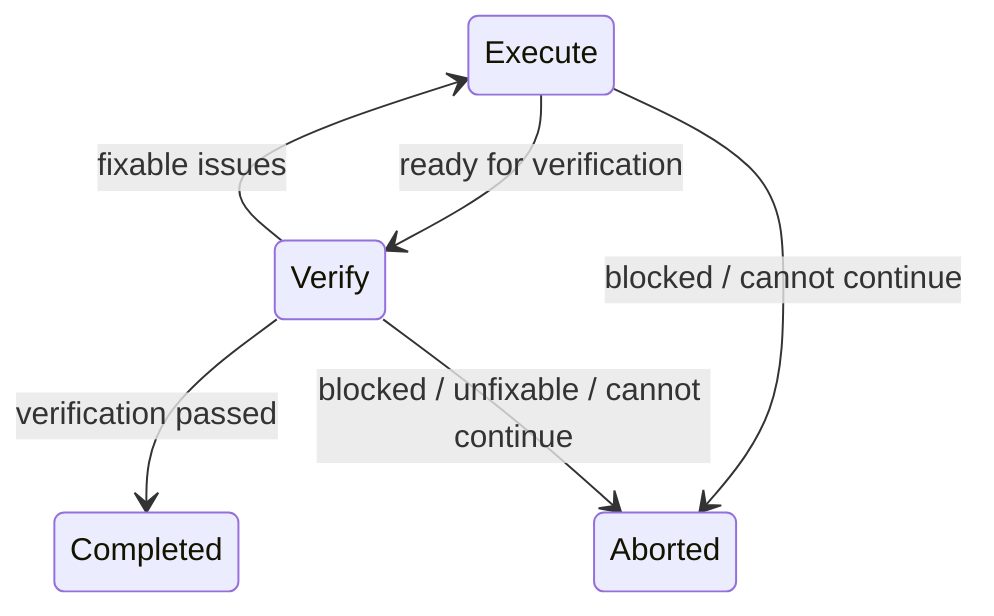

# dev-workflow

Pi extension that adds lightweight workflow modes on top of the repo's existing tools.

## What it does

- registers `/normal`, `/plan`, `/execute`, and `/verify` commands
- switches tool access only on explicit mode transitions
- applies per-mode thinking defaults only on explicit mode transitions
- publishes workflow-mode state over `pi.events` for other extensions
- injects a stable mode-specific contract into `before_agent_start`
- sends a kickoff user message on `/plan`, `/execute`, and `/verify` so the agent starts in the new mode after any configured pre-switch compaction
- compacts large idle sessions before `/plan`, `/execute`, and `/verify` mode switches to reduce expensive cache misses after the tool set changes
- provides Plan-mode-only `write_plan` and `edit_plan` tools scoped to `.plans/` at the repo root
- builds a custom compaction summary so long-running workflow sessions keep their mode and TODO context
- optionally requires the agent to end Execute/Verify phases with `workflow_advance`, either for capped Execute ↔ Verify advances or terminal completion/abort decisions
- follows up up to 2 times when auto advance is enabled and the agent stops in Execute/Verify without calling `workflow_advance`
- injects an Execute-mode-only hidden reminder when the agent has gone several turns without using `todo`
- currently leaves `mcp_call` available in Plan and Verify mode; read-only broker filtering is deferred to a later revision

## Modes

### Normal

Restores the session's baseline tool set and baseline thinking level. No workflow prompt contract is active, and `/normal` does not send a kickoff message.

### Plan

- intended for clarification, repo reading, approach comparison, and plan authoring
- uses read-oriented tools plus `write_plan` and `edit_plan`
- defaults thinking to `medium` (`planThinkingLevel`)
- expects plan files to live under `.plans/` at the repo root
- encourages a bounded grilling loop for non-trivial work: one focused question at a time, recommended answers, repo exploration before asking repo-answerable questions, 2-3 approaches with a recommendation, testable acceptance criteria, explicit documentation-impact decisions, and YAGNI planning

### Execute

- intended for code changes and deterministic local execution
- uses `read`, `edit`, `write`, `bash`, and `todo`
- defaults thinking to `low` (`executeThinkingLevel`)
- encourages regular commits at logical checkpoints instead of one large end-of-run commit
- reminds the agent to use `todo` after a configurable number of Execute-mode turns without TODO activity; the reminder is injected only into model context and tells the agent not to mention it to the user
- when auto advance is enabled, must call `workflow_advance` before stopping: use `state: "verify"` when implementation is ready for verification and all changes are committed, or `state: "aborted"` when the workflow is blocked, unfixable, or cannot continue

### Verify

- intended for deterministic checks, review, and findings capture
- stays read-mostly
- defaults thinking to `high` (`verifyThinkingLevel`)
- reports a structured verification result: overall verdict (`pass`, `fail`, or `blocked`), deterministic checks and results, per-acceptance-criterion verdicts with evidence, findings / next actions, and any user-accepted known issues

When auto advance is enabled, Verify must call `workflow_advance` before stopping. It should use `state: "execute"` only when it found fixable issues. If verification passes, is blocked, finds unfixable issues, or cannot continue, it should use `state: "completed"` or `state: "aborted"` so the workflow exits to Normal mode explicitly.

## Automatic advance

The `workflow_advance` tool is active only in Execute and Verify modes when auto advance is enabled. It accepts a single `state` decision plus a concise reason:

```json
{
  "state": "verify",
  "reason": "Implementation is complete and ready for checks"
}
```

For a terminal workflow decision:

```json
{
  "state": "completed",
  "reason": "Verification passed and all acceptance criteria are satisfied"
}
```

Use `state: "aborted"` instead of `completed` when the workflow is blocked, unfixable, or cannot continue. Terminal decisions restore Normal mode and terminate the current run.

Allowed transitions:



Execute mode may advance only to Verify or aborted. Verify mode may advance only to Execute, completed, or aborted. The tool validates the current mode, configuration, clean worktree requirement, and fix-loop cap; it does not ask the agent to self-declare whether issues are fixable. That semantic decision is part of the mode contract.

Execute → Verify advances run `git status --porcelain=v1` in the current workspace and fail when staged or unstaged uncommitted changes are present. Commit or revert implementation changes before advancing to Verify. Non-git workspaces are allowed.

Accepted advances switch directly to the requested mode and queue the follow-up kickoff message. Verify → Execute advances consume the configured fix-loop budget; Execute → Verify advances do not.

Accepted advances compact before changing tools/thinking when `autoCompactOnAdvance` is enabled and current context usage is at least `autoCompactAdvanceMinTokens`. If advance compaction fails, the extension reports the failure when UI is available and continues with the advance.

If auto advance is enabled and the agent stops in Execute or Verify mode without calling `workflow_advance`, the extension queues a follow-up user message asking for the missing workflow decision. This fallback is capped at 2 follow-ups per mode entry or successful advance, skips when another message is already pending, and then leaves the current mode unchanged.

## Plan files

Plan files are ordinary markdown files stored under `.plans/` in the repo root.

The Plan-mode contract requires a discovery-first flow before durable plan writing:

1. Discover: read relevant repo context and run a bounded grilling loop.
2. Explore: compare viable approaches with trade-offs and a recommendation.
3. Validate: confirm the chosen direction and unresolved assumptions with the user.
4. Author: write or update the `.plans/` markdown file.

For non-trivial work, the agent should ask requirements-discovery questions until the purpose, constraints, success criteria, major trade-offs, and acceptance criteria are clear enough to execute. It should ask one focused question at a time, include a recommended answer, resolve upstream decisions before downstream questions, and explore the repo instead of asking whenever the repo can answer the question. This grilling behavior is inspired by Matt Pocock's [`grill-me` skill](https://github.com/mattpocock/skills/tree/main/skills/productivity/grill-me). The agent should use `ask_user` for material decisions with multiple valid directions, and it should not call `write_plan` or `edit_plan` until discovery, exploration, and validation are complete unless the user explicitly asks to skip discovery or provides a complete implementation-ready plan.

The Plan-mode contract includes a plan template for substantial work. Agents should use it unless there is a clear reason to simplify:

```md
# <Short Title> Plan

## Goal

<One sentence describing the intended outcome.>

## Constraints

- <Hard constraints, repo conventions, scope boundaries, or user preferences.>

## Acceptance Criteria

- AC-1: <Observable criterion verified by a test, command, file state, or UI state.>
- AC-2: <Observable criterion verified by a test, command, file state, or UI state.>
- AC-3: <Observable criterion verified by a test, command, file state, or UI state.>

## Chosen Approach

<Recommended approach and the key trade-off behind it.>

## Documentation Impact

<List docs, READMEs, examples, changelogs, or user-facing references to update, or state that no documentation updates are required and why.>

## Assumptions / Open Questions

- Q1: <Assumption or unresolved question, with owner/status when known.>

## Ordered Tasks

### T1: <Task title>

Covers: AC-<n>

- <Implementation intent and relevant files or areas, not a line-by-line diff.>

## Verification Checklist

- [ ] V1: <Command, test, or observable check for AC-<n>.>
- [ ] V2: Confirm Documentation Impact was followed.

## Known Issues / Follow-ups

- <Accepted limitation, follow-up, or "None known.">
```

`Acceptance Criteria`, `Ordered Tasks`, and `Verification Checklist` use stable IDs such as `AC-1`, `T1`, and `V1` so Execute and Verify mode can reference specific requirements. `Documentation Impact` should list required docs updates or state that none are needed. The `Verification Checklist` should include checking that this documentation decision was followed.

`write_plan` creates or replaces `.plans` files. `edit_plan` applies exact text replacements to existing `.plans` files. In the TUI they render like Pi's built-in write/edit tools: write calls show the target path and line count, and edit results show compact addition/removal counts with the diff available when expanded.

## Command behavior

- `/plan [context]` enters Plan mode and starts the planning process with the provided context
- `/execute [context]` enters Execute mode and starts implementation with the provided context
- `/verify [context]` enters Verify mode and starts verification with the provided context
- `/normal` exits workflow mode and restores ordinary Pi behavior

The extension does not pre-create or preselect a workflow brief. Slash-command arguments are passed through to the agent, which decides whether to read, create, or refine plan files.

## Integration API

For programmatic integration from other extensions, see [API.md](./API.md).

The extension publishes workflow-mode state changes over `pi.events` so other extensions can react without duplicating workflow state.

## Configuration

Configure via `extension:dev-workflow` in Pi settings. Environment variables override settings when set. Use `/dev-workflow-config` to display the effective parsed config.

| Field                               | Default  | Environment override                                 | Description                                                                                                      |
| ----------------------------------- | -------- | ---------------------------------------------------- | ---------------------------------------------------------------------------------------------------------------- |
| `autoCompactOnModeSwitch`           | `true`   | `DEV_WORKFLOW_AUTO_COMPACT_ON_MODE_SWITCH`           | Enables pre-switch compaction for `/plan`, `/execute`, and `/verify`.                                            |
| `autoCompactMinTokens`              | `50000`  | `DEV_WORKFLOW_AUTO_COMPACT_MIN_TOKENS`               | Context-token threshold for slash-command pre-switch compaction.                                                 |
| `autoCompactOnAdvance`              | `true`   | `DEV_WORKFLOW_AUTO_COMPACT_ON_ADVANCE`               | Enables pre-switch compaction for accepted `workflow_advance` transitions.                                       |
| `autoCompactAdvanceMinTokens`       | `30000`  | `DEV_WORKFLOW_AUTO_COMPACT_ADVANCE_MIN_TOKENS`       | Context-token threshold for advance pre-switch compaction.                                                       |
| `autoAdvanceEnabled`                | `false`  | `DEV_WORKFLOW_AUTO_ADVANCE_ENABLED`                  | Enables required Execute/Verify `workflow_advance` decisions, advances, and bounded missing-decision follow-ups. |
| `autoAdvanceMaxFixLoops`            | `2`      | `DEV_WORKFLOW_AUTO_ADVANCE_MAX_FIX_LOOPS`            | Caps Verify → Execute loopbacks.                                                                                 |
| `todoReminderEnabled`               | `true`   | `DEV_WORKFLOW_TODO_REMINDER_ENABLED`                 | Enables the Execute-mode-only hidden reminder when `todo` has not been used recently.                            |
| `todoReminderTurnsSinceTodo`        | `3`      | `DEV_WORKFLOW_TODO_REMINDER_TURNS_SINCE_TODO`        | Execute-mode assistant turns without a `todo` result before the reminder may fire.                               |
| `todoReminderTurnsBetweenReminders` | `3`      | `DEV_WORKFLOW_TODO_REMINDER_TURNS_BETWEEN_REMINDERS` | Minimum Execute-mode assistant turns between reminder injections.                                                |
| `planThinkingLevel`                 | `medium` | `DEV_WORKFLOW_PLAN_THINKING_LEVEL`                   | Thinking level applied when entering Plan mode.                                                                  |
| `executeThinkingLevel`              | `low`    | `DEV_WORKFLOW_EXECUTE_THINKING_LEVEL`                | Thinking level applied when entering Execute mode.                                                               |
| `verifyThinkingLevel`               | `high`   | `DEV_WORKFLOW_VERIFY_THINKING_LEVEL`                 | Thinking level applied when entering Verify mode.                                                                |

Example settings:

```json
{
  "extension:dev-workflow": {
    "autoCompactOnModeSwitch": true,
    "autoCompactMinTokens": 50000,
    "autoCompactOnAdvance": true,
    "autoCompactAdvanceMinTokens": 30000,
    "autoAdvanceEnabled": false,
    "autoAdvanceMaxFixLoops": 2,
    "todoReminderEnabled": true,
    "todoReminderTurnsSinceTodo": 3,
    "todoReminderTurnsBetweenReminders": 3,
    "planThinkingLevel": "medium",
    "executeThinkingLevel": "low",
    "verifyThinkingLevel": "high"
  }
}
```

Boolean environment overrides accept `1`/`true` and `0`/`false`. Thinking-level fields accept `off`, `minimal`, `low`, `medium`, `high`, and `xhigh`.

## Logging

This extension does not write retained logs or diagnostic files. Pre-switch compaction failures, including advance pre-compaction failures, are reported to the user and the requested mode switch continues. Terminal decision notifications and missing-decision fallback notifications are UI-only and are not retained as separate log files. Automatic advances queue transient user messages. Missing-decision follow-ups are queued as transient user messages. TODO reminders are injected as hidden context for the model, not as retained log files or user-visible messages.

## Persistence and compaction

Workflow mode, automatic advance loop counters, missing-decision follow-up counters, and TODO reminder counters are in-memory session state. New or restored sessions start in Normal mode with these counters reset.

By default, when an idle session has at least 50,000 context tokens, `/plan`, `/execute`, and `/verify` compact before changing tools/thinking and before sending the kickoff message. Slash-command pre-switch compaction is skipped when disabled, when usage is below the threshold or unknown, or when the command is invoked while the agent is not idle. If compaction fails, the extension reports the error and continues with the requested mode switch.

Accepted tool-driven automatic advances use a separate threshold. By default, when current context usage has at least 30,000 tokens, `workflow_advance` compacts before changing tools/thinking and before queueing the follow-up kickoff. Advance pre-switch compaction is skipped when disabled, when usage is below the threshold or unknown, or when the advance is rejected. If advance compaction fails, the extension reports the error and continues with the advance.

During compaction, the extension summarizes the active workflow shell state instead of relying on raw conversation history. For pre-switch compaction, including advance compaction, the summary records the target mode so the compacted context matches the kickoff that follows. The summary preserves:

- current or target mode
- tactical TODO state
- next intended action

## File layout

- `index.ts` — commands, event hooks, tool gating, and plan-scoped tools
- `artifact.ts` — `.plans/` path validation and exact-text edit helpers
- `modes.ts` — tool sets, mode contracts, and thinking defaults
- `compaction.ts` — workflow-aware compaction summary helpers
- `api.ts` — curated public event contract for other extensions
- `API.md` — programmatic integration docs for the `api.ts` surface
- `types.ts` — shared local types
