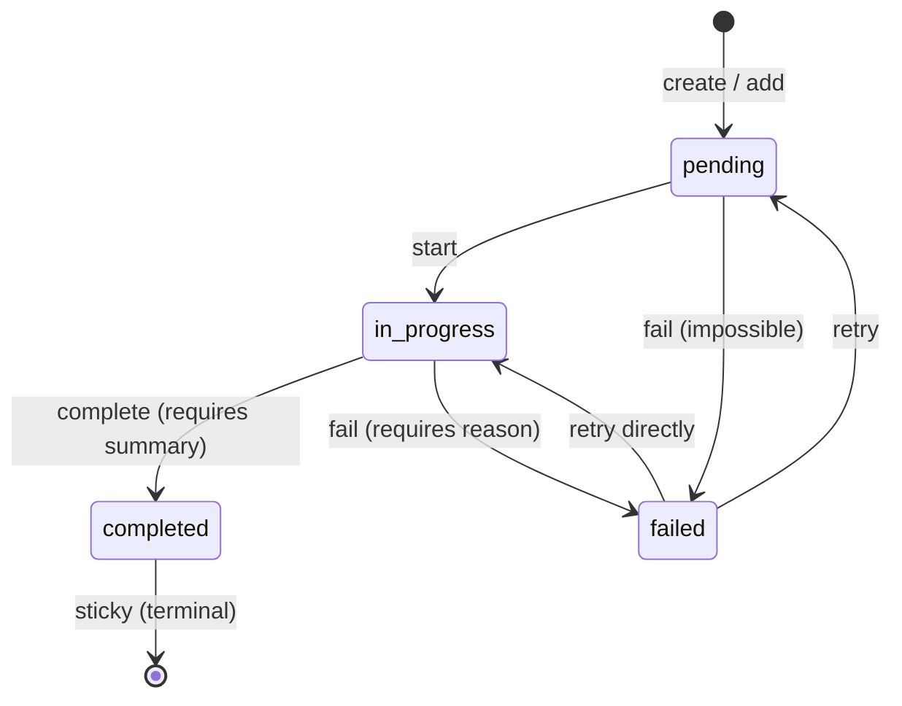

# task-list

Pi extension providing session-scoped task tracking with agent tools and a sticky TUI widget.

## Public API

Other extensions may import the following from `api.ts`. Anything not listed here is internal and may change without notice.

```ts
import { taskList } from "../task-list/api.ts";
```

- `taskList` — the singleton store described below.
- Types: `Task`, `TaskStatus`, `TaskListState`, `TaskStore` (re-exported from `state.ts`).

### `taskList.create(tasks: { title: string }[]): Task[]`

Replace the list with a new set of pending tasks and return them with assigned ids (1-based). Throws if the existing list still has pending or in-progress tasks; if every existing task is terminal (`completed` or `failed`), the old list is auto-cleared first.

### `taskList.add(title: string): Task`

Append a single pending task to the end of the list and return it. Used when the agent or a workflow discovers work mid-run that wasn't in the original plan.

### `taskList.start(id: number): void`

Transition task `id` from `pending` to `in_progress`. Stamps `startedAt` on first start. Throws on invalid transitions or unknown ids.

### `taskList.complete(id: number, summary: string): void`

Transition task `id` from `in_progress` to `completed`. `summary` is required and non-empty — it's the human-readable result shown in the final report. Stamps `completedAt`.

### `taskList.fail(id: number, reason: string): void`

Transition task `id` to `failed` from either `pending` or `in_progress`. `reason` is required and non-empty. Stamps `completedAt`.

### `taskList.setActivity(id: number, text: string): void`

Set the dim inline activity text shown after an `in_progress` task title (e.g. `"editing src/foo.ts"`). Throws if the task is not `in_progress`. Cleared automatically when the task leaves `in_progress`.

### `taskList.get(id: number): Task | undefined`

Return the task with the given id, or `undefined`.

### `taskList.all(): Task[]`

Return the current tasks array (live reference; do not mutate).

### `taskList.clear(): void`

Remove all tasks and reset the id counter. Called on `session_shutdown` and usable by consumers who want to start over.

### `taskList.subscribe(fn: (state: TaskListState) => void): () => void`

Register a listener that fires after every mutation. Returns an unsubscribe function. The extension itself subscribes to drive sticky-widget re-renders.

### `taskList.reconcile(payload: ReconcilePayload): ReconcileResult`

Internal method used by `task_list_set`. Atomically validates and applies a bulk task-list replacement. Prefer the `task_list_set` agent tool for agent use; use the individual mutation methods (`start`, `complete`, `fail`) for extension-to-extension calls.

## State model

Every task moves through a small state machine. The rules live in `VALID_TRANSITIONS` in `state.ts` and any illegal transition throws synchronously.

- `pending` — created but not started. `start` moves it to `in_progress`; `fail` is permitted but unusual (covers "already impossible" at plan time).
- `in_progress` — actively being worked on. `complete` requires a non-empty summary; `fail` requires a non-empty reason.
- `completed` — terminal. Cannot be re-opened.
- `failed` — non-terminal: can retry back to `pending` or resume directly as `in_progress`.



**Completion is sticky** — once a task reaches `completed` there is no edge back out. This is the anti-perfectionism nudge: the agent cannot re-open work to polish it further, so "good enough to mark done" becomes a one-way commitment and the pipeline actually finishes.

## Agent tools

The agent interacts with the task list exclusively through two tools registered by this extension.

### `task_list_set`

Atomically replace the task list. Pass the complete desired list — the system reconciles additions, updates, and removals in one step.

**Parameters:**

```ts
{
  tasks: Array<{
    id?: number; // id of an existing task to update; omit for new tasks
    title: string; // required; for existing tasks, the stored title is authoritative
    status?: "pending" | "in_progress" | "completed" | "failed"; // default: "pending"
    summary?: string; // required when status is "completed"
    failure_reason?: string; // required when status is "failed"
  }>;
}
```

**Reconciliation rules:**

- Tasks in the payload with no `id` are appended as new tasks with auto-assigned ids.
- Tasks in the payload with an `id` are carried over; a `status` change is validated against `VALID_TRANSITIONS`.
- Tasks currently in the store that are **omitted** from the payload: dropped if `completed`/`failed`; the whole call is rejected if any are `pending`/`in_progress`.
- All validation errors are collected before rejecting — no partial writes.

**Success result text:**

```
5 tasks (2 done, 0 failed, 1 in progress, 2 pending)

1. Bug fix — completed (summary: "Fixed the off-by-one in pagination")
2. Add docs — completed (summary: "Added README section on task ids")
3. Refactor utils — in_progress
4. Wire CI — pending
5. Add benchmarks — pending
```

**Error result text:**

```
task_list_set rejected — fix all of these and retry:

- Task 3 ("Add tests"): cannot transition completed → pending (completion is sticky)
- Task 5 ("Refactor utils"): status is "completed" but summary is missing
- Live tasks omitted from payload: 2 ("Bug fix"), 4 ("Add docs")

Current list (unchanged):
1. Bug fix — in_progress
2. Add docs — pending
3. Add tests — completed
...
```

On error the store is left unchanged and the full error list is returned so the agent can fix all issues in a single follow-up call.

### `task_list_get`

Read the current task list with no side effects. Returns the same compact format as `task_list_set`'s success result text. Use this before calling `task_list_set` to inspect current task ids and statuses.

**Parameters:** none.

## Slash command

### `/task-list-clear`

Drop all tasks from the task list immediately, without confirmation. Calls `taskList.clear()` and emits an info notification. This is the user's escape hatch when the workflow conflict gate fires (`create()` throws because live tasks are present).

## Sticky widget

The extension renders the task list as a sticky widget placed `belowEditor` (key `"task-list"`). On `session_start`, it subscribes to the store and mounts the widget via `ctx.ui.setWidget(key, content, { placement: "belowEditor" })`. Each later store mutation updates that same widget in place.

**Auto-show / auto-hide:** when the store transitions from empty to non-empty the widget appears; when it transitions from non-empty to empty the widget is dismissed (`setWidget(key, undefined)`). On `session_shutdown` the store is cleared and the widget is removed.

**Layout:**

```
5 tasks (1 done, 1 failed, 1 in progress, 2 pending)
done:        ✔ Draft rate limiter config
failed:      ✗ Wire config into middleware · missing env var
in progress: ◼ Add tests for rate limiter · running bun test src/rate-limit.test.ts
pending:     ◻ Add IP-based rate limit key
             ◻ Update README
```

Glyphs: `◻` pending, `◼` in progress, `✔` completed, `✗` failed. Completed rows are struck through in the success color; in-progress rows are bold in the accent color; pending rows are dimmed; failed rows are bold red with their failure reason appended after a `·`.

While a task is `in_progress`, `setActivity(id, text)` appends a dim `· <text>` after the title so viewers can see the current sub-step. Activity is cleared automatically on transition out of `in_progress`.

**Compact 7-line cap:** although Pi can render more, this widget intentionally caps itself at 7 lines total: 1 header line + up to 6 content rows.

The widget always uses the same sectioned layout, even when the list is small. Visible sections appear in this order and disappear when empty:

1. `done`
2. `failed`
3. `in progress`
4. `pending`

`done` and `failed` each keep recent items (completed within the last 30s) ahead of older items so fresh outcomes remain visible for a short grace window.

Row allocation is section-aware:

1. Give each non-empty section 1 visible row.
2. Borrow remaining rows in this order: `in progress` → `pending` → `failed` → `done`.

When a section hides tasks, its first visible row shows a local hidden count like `done (+2 more):` or `pending (+1 more):`. There is no global `+N more` row.

Section prefixes are padded to a shared width so task glyphs and titles align horizontally across sections, and widget rows no longer have a leading left tab.

## Consumers

The `autopilot` extension (same repo) is the primary consumer — its orchestrator calls `create` once the plan is parsed, then drives `start` / `setActivity` / `complete` / `fail` as each task runs. The task-list extension owns all rendering (sticky widget below the editor); autopilot's widget shows phase, subagent, clock, and breadcrumb only. The API is deliberately public so other extensions (and user skills loaded at runtime) can share the same task-list surface without each one inventing its own renderer.

## How it works

- `createStore()` in `state.ts` returns a fresh `TaskStore` closure; `api.ts` instantiates one module-level singleton so every import of `../task-list/api.js` sees the same tasks.
- Every mutating method calls an internal `notify()` that fans out to every registered subscriber.
- `index.ts` registers the `task_list_set` and `task_list_get` agent tools plus the `/task-list-clear` slash command. On `session_start` it subscribes to the store, and each notification calls `ctx.ui.setWidget` with the rendered string array (or `undefined` to dismiss). On `session_shutdown` it unsubscribes, dismisses the widget, and clears the store.
- On `session_shutdown` the extension unsubscribes, clears the store, and dismisses the widget so a follow-on session starts fresh.

## Inspiration

- Claude Code's `TaskListV2` component (v2 task tool) — inline multi-task widget with live status glyphs and auto-truncation, the direct visual reference for this extension's renderer.
- Claude Code's `TodoWrite` tool — the auto-clear-on-complete pattern when a new list is created over a fully-terminal list, so the agent isn't forced to manually reset between work items.
- [ralph-wiggum](https://github.com/ghuntley/ralph) `.ralph/*.md` checklist pattern — plain-text, append-only task file as the agent's durable plan; this extension keeps the spirit (linear, numbered, sticky completion) but lives in memory instead of on disk.

## File layout

- `state.ts` — `Task`, `TaskStatus`, `TaskListState` types, the `VALID_TRANSITIONS` table, the `reconcile` implementation, and the `createStore()` factory.
- `api.ts` — instantiates the `taskList` singleton.
- `render.ts` — pure helpers (`glyphFor`, `styleFor`, `summarizeCounts`, `truncateWithPriority`) and `renderWidgetLines` which produces the `string[]` body for the sticky widget.
- `tools.ts` — registers the `task_list_set` and `task_list_get` agent tools.
- `index.ts` — extension entry point: registers tools, the `/task-list-clear` command, and the store subscriber that drives the sticky widget.
