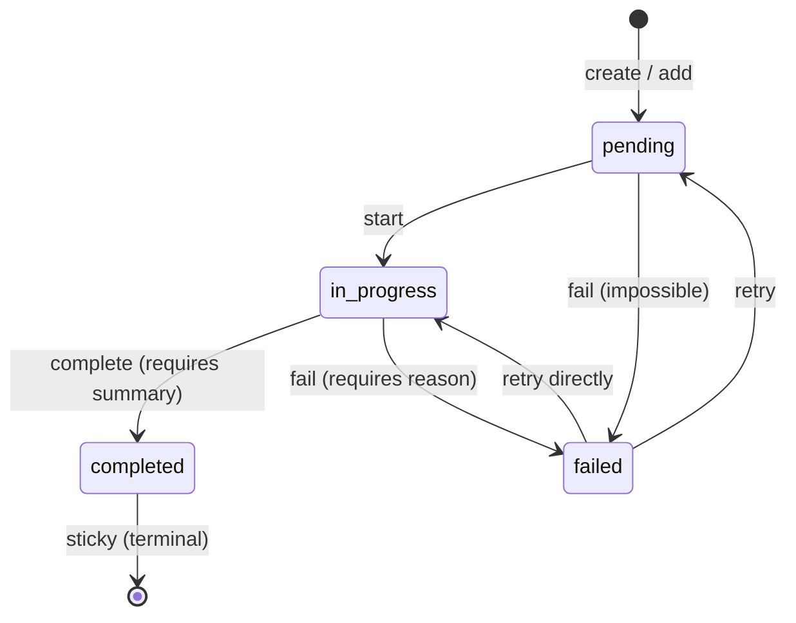

# task-list

Pi extension providing session-scoped task tracking with a rich inline TUI rendering.

## Public API

Other extensions may import the following from `api.ts`. Anything not listed here is internal and may change without notice.

```ts
import { taskList } from "../task-list/api.js";
```

- `taskList` — the singleton store described below.
- Types: `Task`, `TaskStatus`, `TaskListState`, `TaskStore` (re-exported from `state.ts`).

### `taskList.create(tasks: Omit<Task, "id" | "status">[]): Task[]`

Replace the list with a new set of pending tasks and return them with assigned ids (1-based). Throws if the existing list still has pending or in-progress tasks; if every existing task is terminal (`completed` or `failed`), the old list is auto-cleared first.

### `taskList.add(title: string, description: string): Task`

Append a single pending task to the end of the list and return it. Used when the agent discovers work mid-run that wasn't in the original plan.

### `taskList.start(id: number): void`

Transition task `id` from `pending` to `in_progress`. Stamps `startedAt` on first start. Throws on invalid transitions or unknown ids.

### `taskList.complete(id: number, summary: string): void`

Transition task `id` from `in_progress` to `completed`. `summary` is required and non-empty — it's the human-readable result shown in the final report. Stamps `completedAt`.

### `taskList.fail(id: number, reason: string): void`

Transition task `id` to `failed` from either `pending` or `in_progress`. `reason` is required and non-empty. Stamps `completedAt`.

### `taskList.setActivity(id: number, text: string): void`

Set the dim second-line text shown under an `in_progress` task (e.g. `"editing src/foo.ts"`). Throws if the task is not `in_progress`. Cleared automatically when the task leaves `in_progress`.

### `taskList.get(id: number): Task | undefined`

Return the task with the given id, or `undefined`.

### `taskList.all(): Task[]`

Return the current tasks array (live reference; do not mutate).

### `taskList.clear(): void`

Remove all tasks and reset the id counter. Called on `session_shutdown` and usable by consumers who want to start over.

### `taskList.subscribe(fn: (state: TaskListState) => void): () => void`

Register a listener that fires after every mutation. Returns an unsubscribe function. The extension itself subscribes to drive inline re-renders.

## State model

Every task moves through a small state machine. The rules live in `VALID_TRANSITIONS` in `state.ts` and any illegal transition throws synchronously.

- `pending` — created but not started. `start` moves it to `in_progress`; `fail` is permitted but unusual (covers "already impossible" at plan time).
- `in_progress` — actively being worked on. `complete` requires a non-empty summary; `fail` requires a non-empty reason.
- `completed` — terminal. Cannot be re-opened.
- `failed` — non-terminal: can retry back to `pending` or resume directly as `in_progress`.



**Completion is sticky** — once a task reaches `completed` there is no edge back out. This is the anti-perfectionism nudge: the agent cannot re-open work to polish it further, so "good enough to mark done" becomes a one-way commitment and the pipeline actually finishes.

## TUI rendering

When the store mutates, the extension publishes a `task-list` custom message that Pi draws inline. The renderer produces a header counting statuses, one line per kept task, and an optional `+N more` line when the list is truncated.

```
5 tasks (2 done, 1 in progress, 2 open)
✔ Draft rate limiter config
✔ Wire config into middleware
◼ Add tests for rate limiter · running bun test src/rate-limit.test.ts
◻ Add IP-based rate limit key
◻ Update README
```

Glyphs: `◻` pending, `◼` in progress, `✔` completed, `✗` failed. Completed rows are struck through in the success color; in-progress rows are bold in the accent color; pending rows are dimmed; failed rows are bold red with their failure reason appended after a `·`.

While a task is `in_progress`, `setActivity(id, text)` appends a dim `· <text>` after the title so viewers can see current sub-step progress. Activity is cleared automatically on transition out of `in_progress`.

Rows are budgeted by terminal height: `min(10, max(3, rows - 14))`. When there are more tasks than the budget, `truncateWithPriority` keeps the most interesting ones in this order:

1. Recently completed (within the last 30s) — a grace window so the user sees the `in_progress → completed` transition before the row scrolls away.
2. In-progress tasks.
3. Pending tasks.
4. Older completed tasks.
5. Failed tasks.

Dropped tasks are summarized as a trailing `+N more` line. Order within each bucket is preserved.

The widget auto-hides on `session_shutdown`: the store is cleared and the subscription is torn down.

## Consumers

The `autopilot` extension (same repo) is the first consumer — its orchestrator calls `create` once the plan is parsed, then drives `start` / `setActivity` / `complete` / `fail` as each task runs. The API is deliberately public so other extensions (and user skills loaded at runtime) can share the same task-list UI without each one inventing its own renderer.

## How it works

- `createStore()` in `state.ts` returns a fresh `TaskStore` closure; `api.ts` instantiates one module-level singleton so every import of `../task-list/api.js` sees the same tasks.
- Every mutating method calls an internal `notify()` that fans out to every registered subscriber.
- `index.ts` registers a message renderer for the `task-list` custom type and subscribes to the store. Each notification snapshots the state, debounces for 100ms, then calls `pi.sendMessage` with the snapshot as `details`. The renderer in `render.ts` turns that snapshot into a `pi-tui` `Text` component.
- Inline custom-type messages are the only rendering strategy in v1. A footer/status-bar fallback was considered but deferred: the renderer has no access to `ExtensionContext`, so there is no clean way to call `ctx.ui.setStatus` from the subscribe path.
- On `session_shutdown` the extension clears the debounce timer, unsubscribes, and clears the store so a follow-on session starts fresh.

## Inspiration

- Claude Code's `TaskListV2` component (v2 task tool) — inline multi-task widget with live status glyphs and auto-truncation, the direct visual reference for this extension's renderer.
- Claude Code's `TodoWrite` tool — the auto-clear-on-complete pattern when a new list is created over a fully-terminal list, so the agent isn't forced to manually reset between work items.
- [ralph-wiggum](https://github.com/ghuntley/ralph) `.ralph/*.md` checklist pattern — plain-text, append-only task file as the agent's durable plan; this extension keeps the spirit (linear, numbered, sticky completion) but lives in memory instead of on disk.

## File layout

- `state.ts` — `Task`, `TaskStatus`, `TaskListState` types, the `VALID_TRANSITIONS` table, and the `createStore()` factory.
- `api.ts` — instantiates the `taskList` singleton.
- `render.ts` — pure helpers (`glyphFor`, `styleFor`, `summarizeCounts`, `truncateWithPriority`) and the `renderTaskListMessage` component builder.
- `index.ts` — extension entry point: registers the custom-message renderer, subscribes to the store, debounces, and wires `session_shutdown` cleanup.
